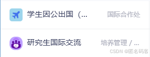
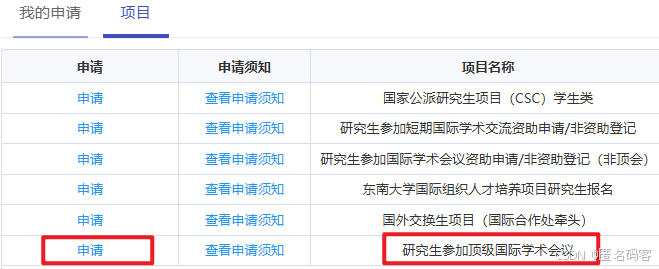
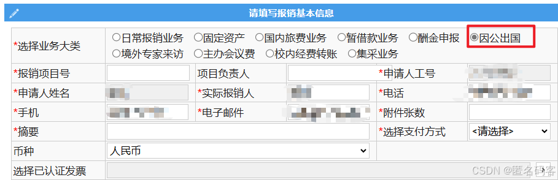

# 流程
## 收到论文录用邮件后

**签证**：有些国家的签证办理周期很长，需要尽快。

**邀请信**：有的会议可以直接在投稿论文的网站中下载邀请信，否则需要向大会秘书发送邮件索要邀请信。

**学校系统**：注意在下图两个地方都要申请：

先进入[【东南大学-综合服务大厅】](https://ehall.seu.edu.cn/new/index.html)中的【研究生国际交流】，选择【研究生参加顶级国际学术会】，在会议名称下拉列表中，可以看到各个学院所规定的顶级学术会议列表，从而知道自己参加的会议是不是顶会。

同时要在[【学生因公出国(境)申请】](https://i.seu.edu.cn/default/index.html#/itemDetail?wid=913100035107135488)中提交申请，这个是国际合作处的，先仔细看一下官网的[【出国申报说明】](https://oic.seu.edu.cn/12540/list.htm)说明，学校对离境和入境时间有严格限制，离境时间可以提前一天，入境时间不能延后。比如会议日程是11号到15号共5天，则要求最早10号离境，最晚15号入境。在系统中填写出发和返回时间时也能看到相应的时间限制。没提前申请或没按照规定时限出入境都会遭到领导的亲切问候。

提交以上两个申请后需要提醒导师及学院领导审核。校级领导一般会在三个工作日内完成审核而不需提醒。总之在出境前一定要完成两个系统的所有审核流程。

### 学生相关签证材料
在[【综合服务大厅】](https://ehall.seu.edu.cn/new/index.html)搜索【研究生证明打印申请】，进入申请可获得【东南大学研究生在读证明】。

[【学生因公出国（境）申报审批】](https://i.seu.edu.cn/default/index.html#/itemDetail?wid=913100035107135488)通过后可以在[【四牌楼老图书馆国际合作处】](https://oic.seu.edu.cn/lxwm/list.htm)获得两个材料【事业单位法人证书】和【资助证明】。

在[【学信网】](https://www.chsi.com.cn/)可以打印【学籍在线验证报告】。

## 准备行程

**机票**：按照国际合作处登记的出入境时间购买机票。一次性购买往返机票可以省钱，不必分开购买。

**酒店**：可以在booking.com等网站或携程等软件预定，可以根据预算选择酒店档次，不同国家地区的标准可参考[【因公临时出国——各国家和地区住宿费、伙食费、公杂费开支标准表】](https://mp.weixin.qq.com/s/82U9kLYM_YEaI6eyWHc-Rg)。

## 参会

在国外注意保存好充值公交卡的收据，进行演讲前需找人帮忙拍照，报销要用。

## 回国后材料准备

**总结材料**：进入学校系统，在【研究生国际交流】中提交总结材料，提交即可，学校领导会在之后给纸质材料盖章时现场审核（没有申请可以跳过）。

**批件**：前往[【国际合作处办公室】](https://oic.seu.edu.cn/lxwm/list.htm)，领导会现场打印【《东南大学出国、赴港澳任务批件》】、【《因公临时出国（境）任务和财务核算审批意见表》】，称这俩文件为【批件】。

**报销单**：登录[【东南大学-财务处】](https://caiwuchujf.seu.edu.cn/)，申请报销单，业务大类选择【因公出国】，项目号和负责人根据学院老师公布的信息填写（**如果是走导师的项目，需要填写导师的项目号和上传发票**）。

之后页面就与日常报销业务一样了，完成后打印报销单。

**如需要填写经费使用计划，按要求填写即可**

### 其他报销材料
1. 报销单中每项支出的发票或收据和大额支出的支付记录。有发票最好，没有发票就用收据，保险起见可以把所有超过1000的支出项的支付记录都打印出来，火车票可以去火车站打印报销凭证。
2. 护照人像页复印件；
3. 出入境记录（支付宝搜出入境小程序可打印）。
4. 如果实际出入境天数超出了申请天数，需要写一个实际在外天数超批件天数说明，说明为何超出了申请天数，然后道歉之类的话，然后准备好挨骂，找国际合作处领导签字盖章。

## 签字盖章提交
至此，手中应当有：**两个【批件】、【报销单】、【经费使用计划】（可选）**，和上面列出的其他报销材料，如：
1. 【来回机票费】的【支付记录】、【发票】、【出行单】。
2. 【酒店费】的【支付记录】、【发票】、【酒店水单】、【入住证明】。
3. 【签证费】的【支付记录】、【税务发票收据】。
4. 【会议注册费】的【支付记录】、【邀请函】、【收据】、【收费标准】、【会议日程】。
5. 【护照】的【照片页】、[【出入境证明】](https://s.nia.gov.cn/mps/main.html)。

**下方为申请了学校报销的一些流程：**

报销单和经费使用计划需要先找导师和学院领导签字，然后把所有这些材料拿到研究生院管理国际会议的办公室，由相关老师签字盖章，同时他也会审核学校系统中提交的总结材料。牌区地址为逸夫建筑馆107，之后老师还会提示到108找报销单项目负责人签字，再到204盖研究生院章。

至此，把所有材料用夹子或别针夹在一起，投递到【自助提交报销单】的机器内，之后财务处可能会发短信提示补充缺失的材料，所有材料补齐后，银行卡会在1-2个工作日内收到报销经费。

# 参考资料
 - [CSDN-含泪总结东南大学国际顶会报销流程](https://blog.csdn.net/weixin_44226356/article/details/143359813)
 - [东南大学-关于研究生出国（境）参加国际会议申请资助的通知](https://seugs.seu.edu.cn/28558/list.htm)
 - [东南大学-信息服务门户-学生因公出国(境)申请](https://i.seu.edu.cn/default/index.html#/itemDetail?wid=913100035107135488)
 - [东南大学-国际合作处-出国申报说明](https://oic.seu.edu.cn/12540/list.htm)
 - [东南大学-综合服务大厅](https://ehall.seu.edu.cn/new/index.html)
 - [东南大学-财务处](https://caiwuchujf.seu.edu.cn/)