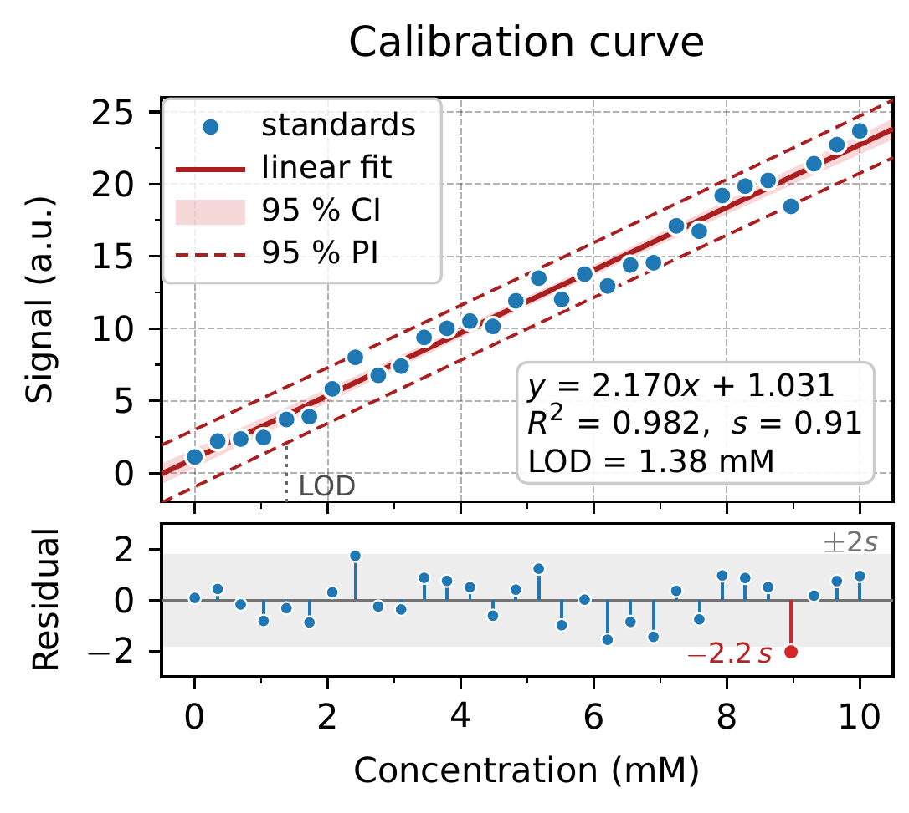
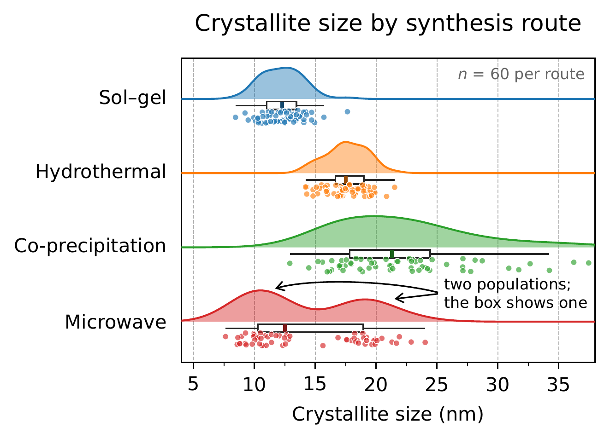
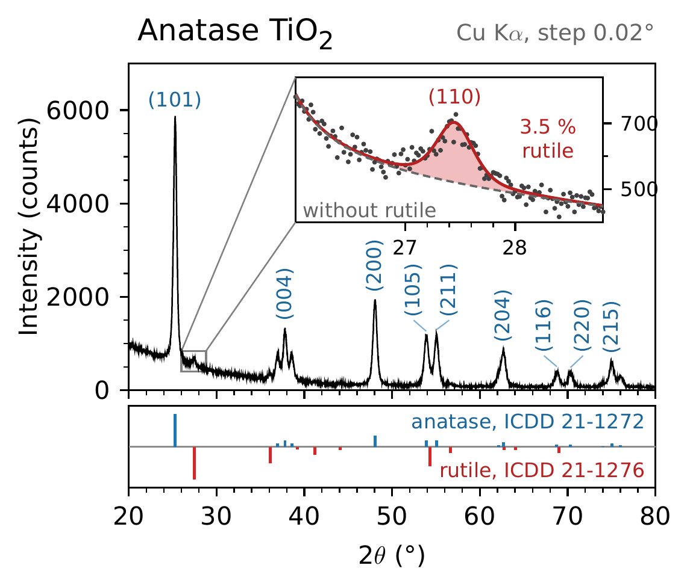
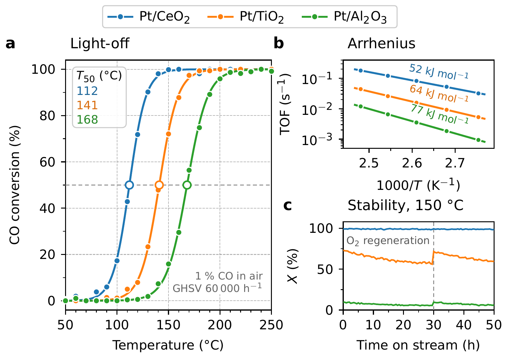

论文已经有一组 Matplotlib 图时，新增的 TikZ 图需要沿用相同的字体、配色和坐标轴外观。单独调整字体还不够，刻度方向、线宽、图例边框和数学字符也会影响整篇论文的视觉一致性。

`tikz-paper-figure` 的 v0.2.0 增加了 `classicfig.sty`，把 DejaVu Sans、tab10、四边框和圆角图例整理成 pgfplots 样式，并配套 18 张科学数据图。数值计算留在 Python，图中的坐标轴、标注和面板由 TikZ 排版。与[原有的论文配图规范](/posts/tech/latex/tikz-paper-figure/)相比，classic 更适合与已有 Python 图配套的场景。

## 风格与使用场景

classic 是本项目的风格名称，对应 Matplotlib 2 以后默认外观的若干主要特征。Matplotlib 自身的 `plt.style.use('classic')` 用来恢复 1.x 风格，两者含义不同，具体变化见 [Matplotlib 2.0 默认样式说明](https://matplotlib.org/2.0.0/users/dflt_style_changes.html)。

| 项目 | 原有 house 风格 | classic 风格 |
|---|---|---|
| 字体 | Source Sans Pro，标识符用 Inconsolata | DejaVu Sans，数学中的拉丁字母与数字尽量随正文字体 |
| 配色 | 固定语义配色，蓝色通常表示本方法 | tab10，`C0` 到 `C9`，同一对象跨图保持同色 |
| 坐标轴 | 左、下两侧轴线 | 四边框，刻度位于左、下两侧并朝外 |
| 图例 | 直接标注或横排图例 | 保留圆角图例框，也可按数据分布使用直接标注 |
| 常见内容 | 方法卡片、基准对比、模型分析 | 光谱、动力学、校准、分布及科学组合图 |

`classicfig.sty` 在这些基础设置上增加浅色网格、白边标记点、文字描边、区间底色和组合图辅助宏。论文已有的图决定选哪套风格；`classicfig.sty` 与 `plotfig.sty` 分别选择字体和轴样式，应在单张图中择一加载。

样式包提供绘制组件，图中的空白区域、图例位置和连线仍由图作者安排。现有 Matplotlib 脚本也需要按图意转写为 pgfplots，仓库没有自动转换任意 Python 图的功能。

## 数据计算与排版分工

示例的数据脚本位于 `assets/examples/classic/data/make_data.py`。拟合参数、残差、核密度估计、箱线统计和椭圆坐标由 NumPy 计算；随机生成的演示数据固定种子，便于复现。TeX 读取坐标与参数，负责线条、文字和位置。

数据进入图文件有两条路径：

- 较长的序列写入 `data/*.dat`，由 `\addplot table` 读取。雨云图、XRD 和带边际分布的散点图采用这条路径。
- 短坐标、拟合参数和统计量打印到终端，再粘贴到 `.tex`。校准曲线中的直线系数、残差和统计框属于这种情况。

因此，修改数据后需要同时核对图中的参数和文字。重新运行 Python 并不会自动替换所有 TeX 数字。每篇论文宜保留自己的计算脚本、输入数据和图源码，使图上的数值能够追溯到同一份输入。

示例脚本里的 Welch 检验、t 分布分位数和 KDE 是便于复用的实现。实际研究还需要根据样本结构选择统计方法，确认误差条的含义、检验假设与区间水平。

## 校准曲线与残差

校准图同时承载观测点、拟合线、区间和统计量。如果全部挤在同一坐标轴中，读者很难区分拟合趋势与误差结构。`calibration.tex` 把主图和残差放在上下两个共享横轴的面板中。



图中数据用于模板演示。主图的填色带表示拟合均值的 95% 置信区间，虚线表示新观测的 95% 预测区间；下方面板显示残差，并标出超出示例中正负两个残差标准差范围的点。图中 LOD 按示例公式计算，复用到具体实验时需要确认检测限定义。

源码中的排版决定与图意直接对应：

1. 用带白边的圆点表示输入数据，用实线表示拟合，点落在线上时仍可辨认。
2. 主图隐藏横轴刻度文字，浓度只在残差面板下方标注，两个面板保持相同的横轴范围。
3. 置信带先绘制，拟合线和数据点后绘制，避免填色覆盖数据。
4. 图例放在左上空白处，方程与统计量放在右下空白处。图例按阅读顺序建立，与绘图顺序分开。

这组示例的主图采用 4.1 cm 高的坐标轴，残差面板为 1.55 cm，间距为 0.22 cm。尺寸是示例的布局参数；更换数据范围或文字长度后，需要重新检查图例与点集的距离。

## 雨云图与分布形态

箱线图用少量统计量概括分布，但同一组四分位数可能对应不同的内部结构。`raincloud.tex` 把半小提琴密度、窄箱线图和带抖动的原始点放在同一行。



每组 60 个点均为合成演示数据。第四组有两个主要聚集区，密度曲线和散点保留了双峰信息。各组密度在示例中缩放到相同峰高，云的高度不表示样本数量，也不宜据此比较各组绝对密度。

`make_data.py` 计算 KDE 和箱线统计，将密度、点坐标写入文件。TeX 只负责将密度放在类别线的一侧，将原始点放在另一侧。标注双峰的两条箭头分别落到两个聚集区，其中一条采用曲线路径，避开相邻组的数据。

更换真实数据时，密度带宽、抖动幅度和箱线须长都需要重新确认。抖动改变的是点的展示位置，横向的测量值仍应保持原值。

## XRD 局部放大与参考面板

XRD 图的难点集中在峰标签和局部细节。`xrd.tex` 用一张主图保留整体图谱，再把较小的峰放进插图，下方排列共享横轴的参考峰位置。



该图由脚本叠加峰形、背景和随机噪声生成。插图中的“3.5% rutile”是模拟模型对金红石组分的设定，不能作为真实样品的相含量测量结果。参考峰位置与标注用于排版演示，实际物相分析需要核对所用数据库和分析方法。

峰标签采用两种处理：孤立峰的标签靠近峰顶，相邻峰的标签向两侧展开，再用细引导线连接。插图放在主图较空的区域；放大框到插图的连线避开峰标签。下方参考面板与主图共用角度坐标，读者可以沿竖直方向比较峰位。

改动主图尺寸后，插图、引导线和标签之间的空隙也会改变。只检查 TeX 编译结果无法发现文字遮挡，需要打开渲染图逐处查看。

## 多面板组合

`subplots.tex` 将一块高面板与两块矮面板组合，分别展示合成的转化率曲线、Arrhenius 关系和稳定性序列。三个面板沿用相同的对象颜色，顶部使用一个整图图例。



组合图中的图例属于整张图。`mpl figure legend` 提供独立图例坐标轴，避免把图例绑定在某个数据面板内，再尝试跨面板定位。各面板通过命名坐标轴的锚点排列，标题、面板字母和纵轴标签分别对齐。

classic 示例还包含直方图、箱线图、热力图、等高线、三维曲面和断轴等形式。完整选型表在仓库的 [`references/classic.md`](https://github.com/HomuraT/tikz-paper-figure/blob/694c0be/skills/tikz-paper-figure/references/classic.md)，选图仍应依据要比较的量。双纵轴需要说明两种尺度，断轴需要清楚标出中断位置，三维曲面需要检查遮挡，不能仅凭示例存在就默认采用。

## 样式复用

将 `classicfig.sty` 放在图源码旁边后，可以从一个小图开始确认字体与基本样式。下面的坐标是人为设定的演示数据。

```latex title="classic-demo.tex"
\documentclass[10pt,tikz,border=4pt]{standalone}
\usepackage{classicfig}
\begin{document}
\begin{tikzpicture}
\begin{axis}[
  classic, mpl grid light, legend upper left,
  xlabel={Time (min)}, ylabel={Response (a.u.)},
  xmin=0, xmax=10, ymin=0, ymax=1.1,
  enlarge x limits=false, enlarge y limits=false
]
\addplot[C0, mpl o, mpl edge] coordinates {
  (0,0.05) (2,0.35) (4,0.60) (6,0.76) (8,0.88) (10,0.95)
};
\addlegendentry{Series A}
\end{axis}
\end{tikzpicture}
\end{document}
```

`classic` 设置字体、轴框和调色板，`mpl grid light` 添加浅色网格，`mpl o` 和 `mpl edge` 设置圆点及白边。图意需要的选项显式写在坐标轴或曲线上，其余部分继承样式包。

在 skill 目录中，已有示例可以直接构建：

```bash
python scripts/check_env.py
python scripts/build_figure.py assets/examples/classic/calibration.tex --png-dir previews
```

classic 需要 DejaVu 字体、`mathastext` 和 `contour` 宏包。环境检查脚本将部分 classic 依赖列为可选项，使用 classic 时仍需逐项确认。`contour.tex` 的等高线使用 LuaLaTeX，文件开头的 `% !TEX program = lualatex` 会让构建脚本选择相应引擎。

复用带 `.dat` 的示例时，需要连同相对路径下的数据文件一起复制。修改示例数据后运行 `make_data.py` 会重写脚本所在目录的数据文件，因此论文应使用自己的工作副本。

## 尺寸与验收

默认单图坐标轴为 7.4 × 4.7 cm，标签和外边距会使最终 PDF 更宽。组合图的宽度预算也需要覆盖图例、纵轴标题和插图外伸部分。构建脚本检查 PDF 页面宽度，图内重叠仍需人工查看。

正文中的图应按论文实际栏宽设计，再以自然尺寸引入。缩窄版面时，优先调整面板排列和文字长度；整体缩放会同时缩小刻度与标注。

交付前需核对数据点、拟合参数和统计框是否来自同一次计算，图例是否遮挡数据，区间与误差条是否有明确定义，以及对象在不同面板中的颜色是否一致。仓库已提供示例渲染图；`tests/README.md` 中的 agent 对照验收任务仍未记录运行结果，示例存在与系统性评测完成应分别说明。

本篇对应 classic 的主体提交 [`352094e`](https://github.com/HomuraT/tikz-paper-figure/commit/352094e)。本体与关系图的组件见[本体与 RDF 配图](/posts/tech/latex/tikz-ontology-diagrams/)，通用的 standalone 与构建流程见[原有配图规范](/posts/tech/latex/tikz-paper-figure/)。
