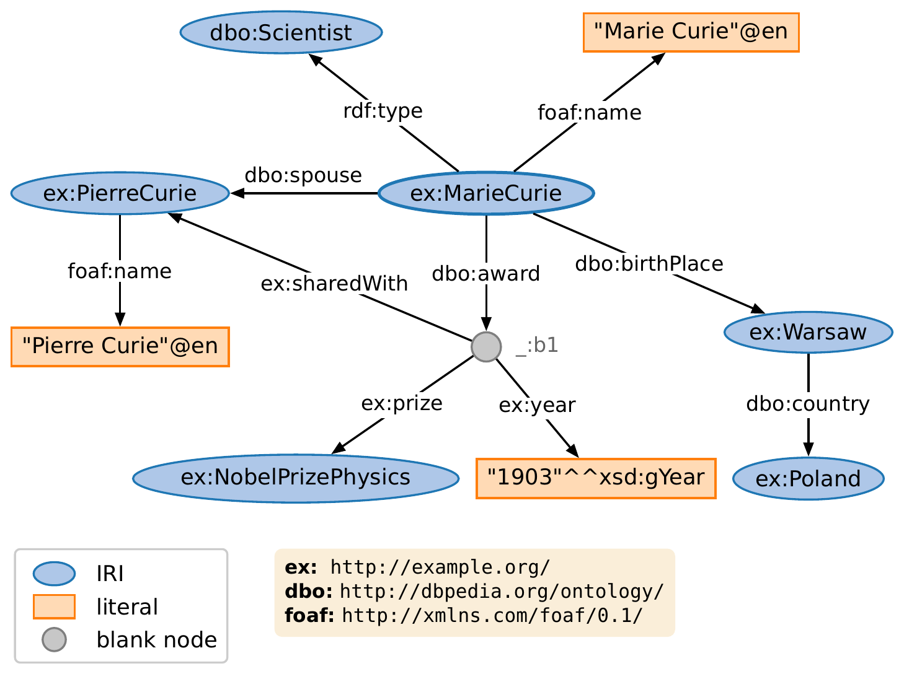
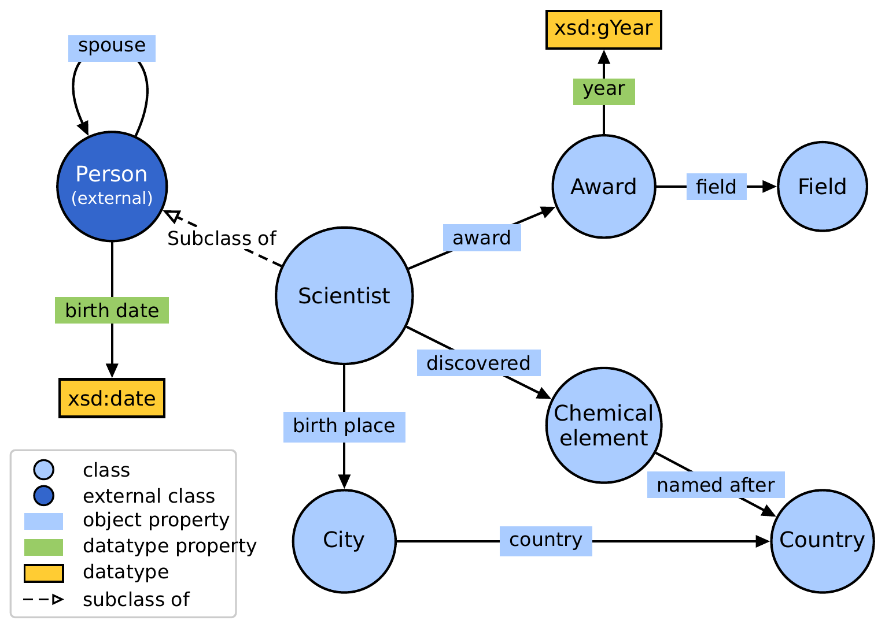
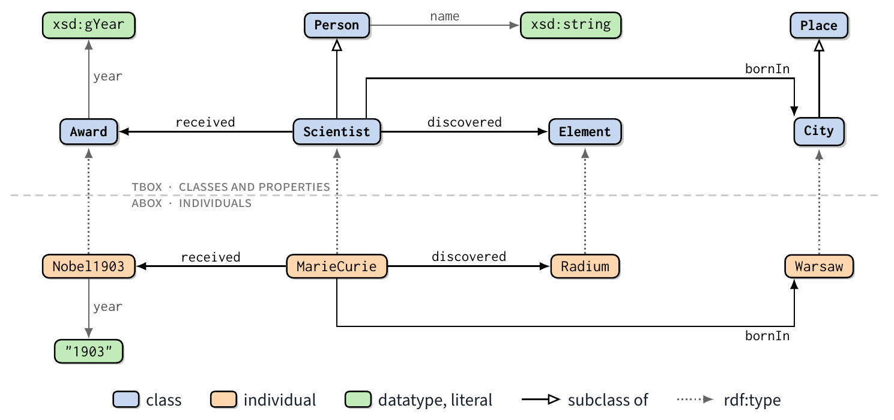
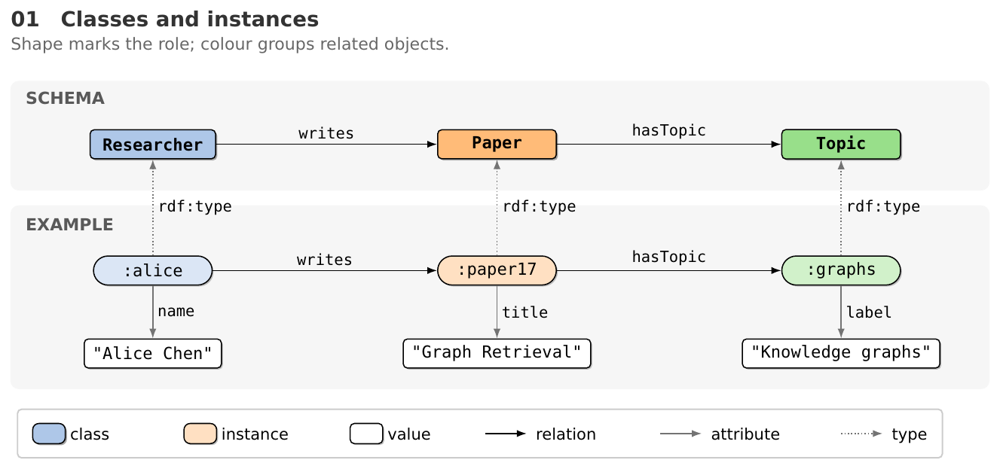
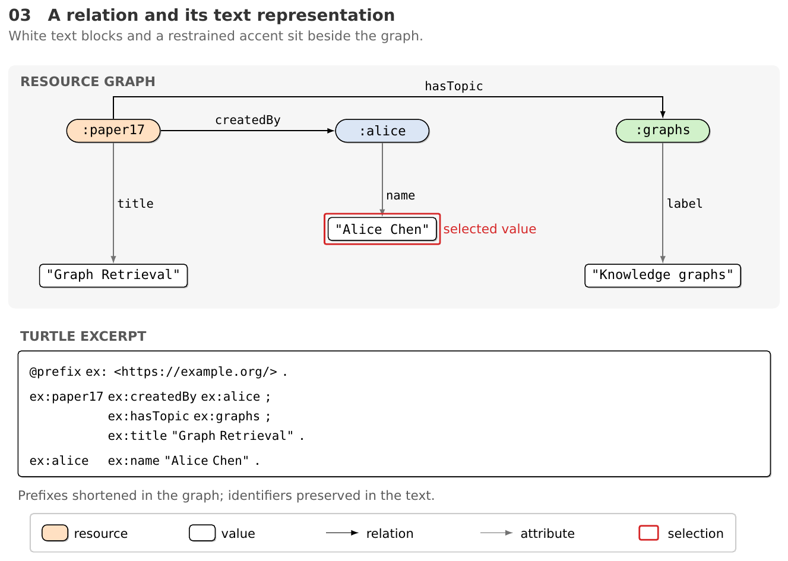
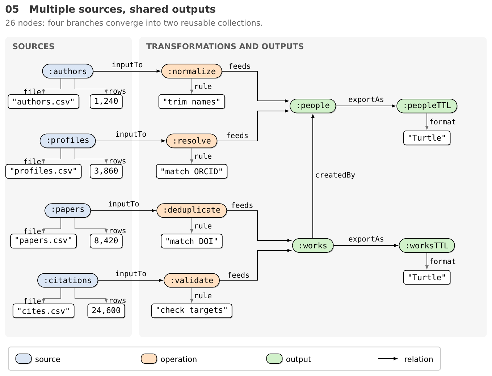
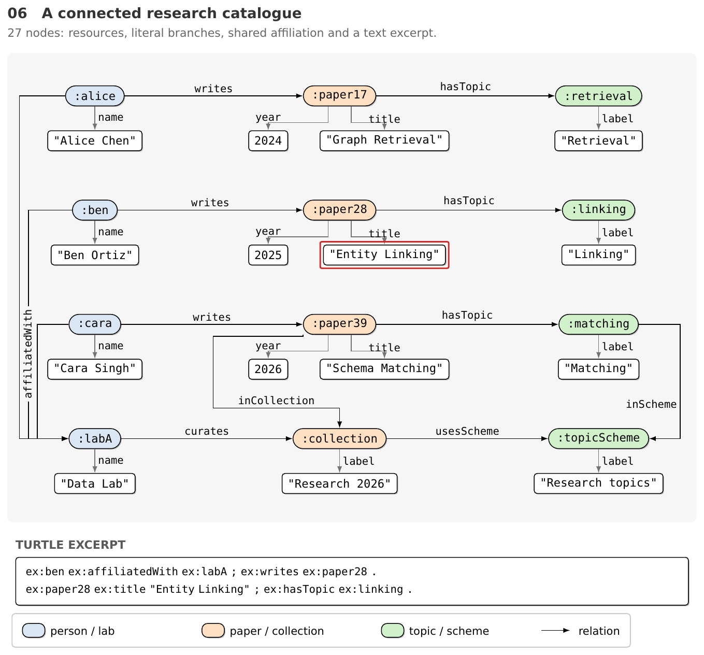

本体和知识图谱中的节点承担不同角色。类定义对象的类型，实例表示具体资源，字面量保存名称、日期或数值。图中若只用相同的方框和箭头，读者需要反复查文字才能分辨角色；节点增加以后，属性标签、共享资源和跨行关系还会争用同一块空间。

`tikz-paper-figure` 的 ontology 扩展将记法、视觉样式和布局分别处理。v0.2.1 增加 RDF、VOWL 与 TBox/ABox 三种示例；v0.2.2 增加 `softontology.sty` 和六张说明性关系图，其中三张包含 26–28 个内容节点。样式集中到宏包中，节点位置与关系路径留在图源码中。

## 记法、样式与布局

三种决定对应不同问题：

| 层次 | 决定的内容 | 示例 |
|---|---|---|
| 记法 | 符号的含义 | 类与实例的区别、子类边、数据属性 |
| 视觉样式 | 元素的外观 | 字体、轮廓、填色、阴影、图例 |
| 布局 | 元素的位置与路径 | 按角色分行、共享节点集中放置、绕开标签的连线 |

选用 VOWL 等已有记法时，需要保留相应符号约定。解释映射、数据来源或资源关系时，也可以定义一套局部视觉规则，并在图例中说明。`softontology.sty` 提供后者的柔和配色组件，soft 指视觉处理，不涉及模糊本体或概率语义。

## RDF 三元组图

RDF 以主语、谓语、宾语三元组表达关系。主语和宾语形成节点，谓语形成有方向的边；IRI、字面量与空白节点的角色可参照 [W3C RDF 1.1 Primer](https://www.w3.org/TR/rdf11-primer/#section-triple)。



`rdf-triples.tex` 用椭圆表示具名资源，矩形表示字面量，较小的圆形表示空白节点。椭圆与矩形的画法可见 [W3C RDF/XML 文档的图 1](https://www.w3.org/TR/rdf-syntax-grammar/#section-Syntax-intro)。这是一种图示约定，RDF 的数据模型本身不依赖节点的颜色与几何形状。

图中保留了字符串的语言标签和年份的 datatype，前缀放在独立说明框中。示例围绕人物、地点和获奖信息组织关系，词汇经过简化，用于说明图示结构，不作为外部知识库记录的完整复刻。

RDF 图中的边方向需要逐条核对。`rdf:type` 从资源指向所属类；属性名称放在对应路径旁边，短边的标签避免遮住箭头。空白节点表示未用 IRI 命名的资源，不能把空白节点当作缺失值。

## VOWL 模式图

VOWL 为 OWL 本体提供视觉记法，适合展示类、对象属性和数据属性之间的结构。项目示例采用 VOWL 2 的视觉元素，可对照 [WebVOWL 项目](https://github.com/VisualDataWeb/WebVOWL)及其[样式实现](https://github.com/VisualDataWeb/WebVOWL/blob/master/src/webvowl/css/vowl.css)查看。WebVOWL 维护者已在仓库中说明旧域名不再属于项目，在线工具入口迁移到 [TIB 的 WebVOWL 服务](https://service.tib.eu/webvowl/)。



`vowl-schema.tex` 使用圆形类节点，把对象属性名称放在边上的蓝色标签中；数据属性用绿色标签，并连接到黄色的数据类型矩形。外部词汇中的类采用深蓝色处理。示例中的自环表达同一类作为属性的定义域与值域，子类关系有独立的虚线和标签。

VOWL 图的颜色参与记法表达，因此示例保留了 VOWL 配色。字体与页面其他图保持协调时，也需要保留类、属性和 datatype 的可辨识符号。

## TBox 与 ABox 的对应

模式层规定类和关系，实例层给出具体资源与事实。把两层画在一张图中，可以直接查看实例关系与模式关系的对应。



`tbox-abox.tex` 上层为类与属性，下层为实例。`MarieCurie` 位于 `Scientist` 下方，`Radium` 位于 `Element` 下方，`rdf:type` 采用竖直虚线。`received` 在上下层都向左，`discovered` 都向右，读者可以按相同方向匹配两层关系。

类框只保留名称，数据属性单独连接到数据类型节点，因此数据属性与对象属性一样可以标注和布线。`bornIn` 的直线路径会穿过其他节点，示例分别从上层上方和下层下方绕行。

TBox/ABox 分层是这张说明图的布局选择。关系图若主要表达数据来源或资源之间的共享依赖，可以采用其他分组方式。

## 柔和样式的复用

`softontology.sty` 把共同的轮廓、填色、字形尺寸和箭头整理为带 `sog` 前缀的 TikZ 样式。宏包不选择字体，示例文档加载 DejaVu Sans 与 DejaVu Sans Mono；使用原有 house 风格的论文可以保留自身字体。



这张图中的人物、论文、主题和名称均为虚构内容。矩形类框与胶囊实例框使用不同形状，同一组相关对象使用相近填色；名称等字面量保持白底，但沿用黑色轮廓、等宽字号和细小阴影。

| 组件 | 样式 | 主要处理 |
|---|---|---|
| 类或元素类型 | `sog kind=颜色` | 小圆角矩形、加粗等宽字、浅色填充 |
| 实例或资源 | `sog entity=颜色` | 胶囊形、较浅填充、常规等宽字 |
| 字面量或字段值 | `sog value` | 白底矩形，与其他节点保持相同轮廓体系 |
| 文本片段 | `sog code` | 白底、较宽内边距、独立行距 |
| 普通关系 | `sog ref` | 细黑箭头 |
| 属性关系 | `sog attr` | 灰色箭头 |
| 类型关系 | `sog type` | 灰色点线箭头 |
| 分区与图例 | `sog region`、`sog key` | 浅背景与轻边框 |

示例节点字号为 8 pt，边标签约 7.4 pt。白底值框与其他节点共享 0.55 pt 黑色轮廓，细小硬阴影帮助区分节点与背景。颜色可以表示领域、来源或角色，但每张图需要明确自己的配色含义。绿色没有固定的“本体”含义，橙色也没有固定的“映射”含义。

最小用法可以直接放进一个 standalone 文档，`softontology.sty` 与源码放在同一目录：

```latex title="ontology-demo.tex"
\documentclass[10pt,tikz,border=5pt]{standalone}
\usepackage[T1]{fontenc}
\usepackage{DejaVuSans}
\usepackage{DejaVuSansMono}
\renewcommand{\familydefault}{\sfdefault}
\usepackage{softontology}
\begin{document}
\begin{tikzpicture}
\node[sog kind=sogblue] (person) at (0,0) {Person};
\node[sog entity=sogblue] (alice) at (0,-1.5) {:alice};
\node[sog value] (name) at (3.5,-1.5) {"Alice Chen"};
\draw[sog type] (alice) -- node[sog lab,right] {rdf:type} (person);
\draw[sog attr] (alice) -- node[sog lab,above] {name} (name);
\end{tikzpicture}
\end{document}
```

代码中的人物为虚构资源。样式包负责节点和边的外观，坐标、文字及关系由图源码决定。接入论文时还应添加与全文一致的图例或图注。

## 图与文本的对应

图可以帮助追踪关系，文本可以保留完整标识符与具体语法。`soft-graph-text.tex` 把资源图与 Turtle 片段放在同一张图中。



图中用缩短的资源名降低标签长度，文本片段保留前缀定义。红框标记选中的名称值，图例说明红框含义。Turtle 部分是节选，图中的所有关系不必都出现在节选中；需要完整逐条对应时，应从同一份数据生成或核对两种表示。

红色边框、删改标记和状态符号都属于可选强调手段。普通关系图可以只保留节点、边和图例，避免让读者把装饰误读为新的语义。

## 密集图的路径安排

节点数量增加后，共享节点的位置会影响整张图的走线。`soft-dense-lineage.tex` 将四个来源分支汇入两个结果集合，结果集合之间再保留一条共享关系。



来源节点及其文件、行数放在左侧；处理操作和规则放在中间；共享结果与输出格式放在右侧。进入同一结果的两条边使用错开的锚点，中间预留折线路径，避免几条边叠成无法辨认的一条。

边标签放在明确的水平或竖直线段旁。对于折线路径，直接按整条路径的某个比例放标签，可能让文字落在拐角。修改节点间距时，需要同时检查标签所在的具体线段。

`soft-dense-catalogue.tex` 则保留共享机构、论文集合与主题体系，适合说明跨行依赖：



两张图的布局不同，共用同一组节点与边样式。26、27 或 28 个内容节点是这些示例的规模，包含字面量，排除标题、标签、图例和文本片段；节点数本身不能保证另一张图同样清晰。长名称、共享边数量和拓扑规律都会改变空间需求。

现有示例采用手工坐标与明确路径。规则较强的图可以按行列安排，关系更不规则的图可以借助布局工具取得初始位置，再整理边和标签。当前 skill 没有自动导入任意 RDF/OWL 并完成排版的管线，也不承担本体推理或语义验证。

## 构建与版面预算

三个原始记法示例采用约 13.8 cm 的宽度预算；六张 soft 示例约为 16.8–17.2 cm，按通栏图设计。在 skill 目录中构建密集示例时，命令为：

```bash
python scripts/build_figure.py assets/examples/ontology/soft-dense-lineage.tex --max-width 500 --png-dir previews
```

`--max-width 500` 是该示例的页面宽度检查阈值，不能直接代替论文模板的栏宽。窄栏需要重新排列节点或拆分图，整体缩小会同时压缩 8 pt 节点文字与边标签。

检查渲染时，除页面尺寸外，还需要逐处核对长字面量、竖直边旁的标签、共享节点的入边和图例符号。图例应复用内容中的实际形状，矩形、胶囊、箭头与说明文字保持对齐。

v0.2.2 的六张 soft 示例提供 TeX、PDF 与 PNG。对应提交记录包含编译和与审阅稿图像一致性的验证；仓库的 agent 对照验收任务尚未记录结果。引用示例时，可以说明已有渲染产物，不能将其扩大为任意输入图都能自动通过的保证。

## 源码与相关内容

ontology 的两次主体提交分别是 [`9772184`](https://github.com/HomuraT/tikz-paper-figure/commit/9772184) 和 [`99fca92`](https://github.com/HomuraT/tikz-paper-figure/commit/99fca92)。完整组件表、九张示例及其适用问题位于 [`references/ontology.md`](https://github.com/HomuraT/tikz-paper-figure/blob/694c0be/skills/tikz-paper-figure/references/ontology.md)。

通用的样式包与 standalone 流程见[论文配图规范](/posts/tech/latex/tikz-paper-figure/)，数据曲线和组合图见 [Matplotlib 风格的科学配图](/posts/tech/latex/tikz-classic-figures/)。本体在数据访问中的用途可以结合[虚拟知识图谱入门](/posts/study/vkg/)阅读，图中的符号和关系应与正文采用的模型保持一致。
