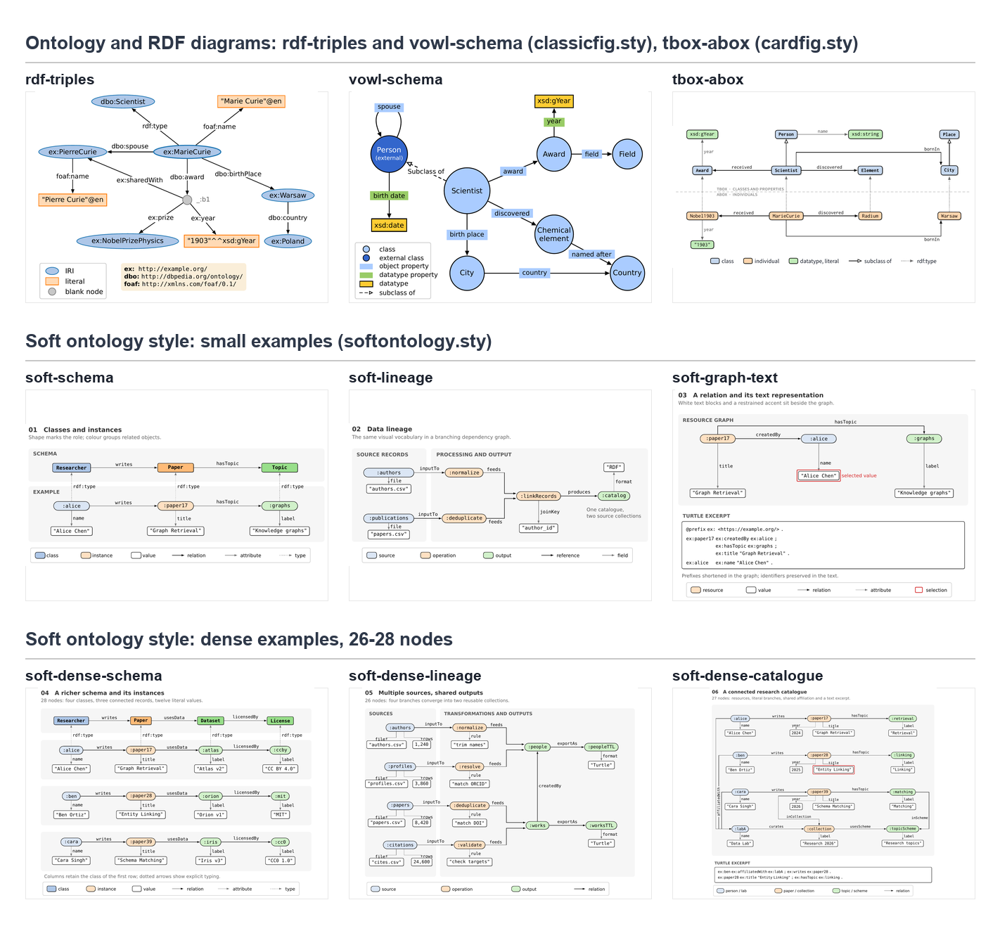

<div class="figure-banner">


</div>

## Skill 简介

[`tikz-paper-figure`](https://github.com/HomuraT/tikz-paper-figure) 是面向论文作者的 TikZ/pgfplots 配图 Skill，适合需要可编辑 TeX 图源、统一字体配色，并希望让代码助手参与绘图和修改的场景。TikZ 负责绘制图形，pgfplots 提供数据坐标轴；Skill 将选图、排版、编译和看图检查整理成可复用的工作流程。

仓库包含给助手读取的 `SKILL.md`、选图与排版参考、`.sty` 样式包、带 TeX/PDF/PNG 的示例，以及环境检查和构建脚本。可以将它安装到 Claude Code，也可以直接复制模板、在本地编译，独立于助手使用。本文使用 v0.2.2 的文件版本。

`tikz-paper-figure` 的 ontology 扩展收录了 9 个示例：3 张常见本体记法图，以及 6 张使用 `softontology.sty` 的说明性关系图。图册覆盖类、实例、属性值、映射与数据来源，便于按要表达的关系选择模板。

## 图册总览

<div class="figure-gallery">



</div>

*点击图片可放大。示例用于展示记法与排版，图中的数据、映射规则和统计值不构成实际研究结果。*

| 分类 | 数量 | 适合表达的内容 |
|---|---:|---|
| 常见记法 | 3 | RDF 三元组、VOWL 类与属性、TBox/ABox 分层 |
| 小型说明图 | 3 | 模式关系、结构化图与文本、映射过程 |
| 密集关系图 | 3 | 多分支映射、数据血缘与共享目录资源 |

各图的 TeX、PDF 和 PNG 位于[示例目录](https://github.com/HomuraT/tikz-paper-figure/tree/694c0be/skills/tikz-paper-figure/assets/examples/ontology)。总览用于比较整体组织方式，具体节点与连线可在相应源码中调整。

## 记法、外观与布局

记法决定符号含义，外观决定字体与轮廓，布局决定节点和路径的位置。RDF 图突出主语、谓语与宾语；VOWL 提供类和属性的视觉约定；TBox/ABox 图将类型层与实例层分开。选图时先确定读者需要理解哪一层关系，再安排颜色与空间。

RDF 的数据模型可参照 [W3C RDF 1.1 Primer](https://www.w3.org/TR/rdf11-primer/#section-triple)，VOWL 的实现参考 [WebVOWL 项目](https://github.com/VisualDataWeb/WebVOWL)。柔和风格示例采用局部图例说明节点与边的角色，`soft` 指视觉处理，不涉及模糊本体或概率语义。

`softontology.sty` 集中定义类、实体、字面量、引用和关系的外观。密集示例通过按角色分行、集中共享节点、错开入边锚点与预留折线路径来减少拥挤。三张密集图各含 26–28 个内容节点，计数包括字面量，不含标题和图例；同样的节点数换成不规则拓扑，仍需重新安排版面。

## 获取与开始使用

先安装 Git、Python 3.9+ 和 TeX Live 2023+（或 MiKTeX），将 `latexmk`、`pdflatex`、Poppler 的 `pdfinfo` 与 `pdftoppm` 加入 PATH。下面的 soft 示例需要 `standalone`、TikZ、DejaVu Sans 与 DejaVu Sans Mono；样式包随仓库提供。直接构建这些关系图无须 NumPy。

从[项目仓库](https://github.com/HomuraT/tikz-paper-figure)获取代码，固定到本文使用的版本，再编译一张小型模式图。命令在 Bash 或 PowerShell 中逐行执行；若 Python 命令名为 `python3`，将后两行的 `python` 相应替换。

```bash
git clone https://github.com/HomuraT/tikz-paper-figure.git
git -C tikz-paper-figure checkout 694c0be
cd tikz-paper-figure/skills/tikz-paper-figure
python scripts/check_env.py
python scripts/build_figure.py assets/examples/ontology/soft-schema.tex --max-width 500 --png-dir previews
```

环境检查覆盖整个 Skill，各图需要的依赖不同，应先补齐所选示例的缺失项。构建脚本通过 `latexmk` 编译，在示例目录生成 `soft-schema.pdf`，将 300 dpi 预览保存为 `previews/soft-schema.png`，并打印页面尺寸和宽度检查结果。脚本自动设置样式包搜索路径，无须先把 `softontology.sty` 安装到 TeX 系统目录。

若需要 Claude Code 调用，将下载仓库中的整个 `skills/tikz-paper-figure` 文件夹复制到论文项目的 `.claude/skills/tikz-paper-figure/`，先创建缺少的父目录。随后可请求：“使用 tikz-paper-figure，根据这份类、实例和关系列表画一张 soft 风格关系图，保留图例，并交付 TeX、PDF 和 PNG。”同时说明节点角色、关系方向和目标栏宽。安装方式见[仓库说明](https://github.com/HomuraT/tikz-paper-figure/blob/694c0be/README.zh-CN.md)。

开始自己的图时，将 `soft-schema.tex` 与 `assets/softontology.sty` 复制到论文的 `figures/` 目录，修改节点、关系和坐标，再用同一构建脚本编译新 `.tex`。先打开 PNG 检查文字与连线；论文加载 `graphicx` 后，可用 `\includegraphics{figures/soft-schema.pdf}` 引入 PDF。若选择前三种记法示例，还应保留各自源码实际加载的样式包和依赖。

六张 soft 示例按约 16.8–17.2 cm 通栏设计。`--max-width 500` 是该示例的页面宽度检查阈值，实际论文应按模板栏宽重新设定。长名称、共享节点入边和边标签是修改后需要重点查看的位置；窄栏通常需要重排或拆图。

这些模板使用手工坐标与明确路径，当前扩展不包含任意 RDF/OWL 的自动导入、自动布局或本体推理。仓库已有渲染产物，agent 对照验收任务尚未记录结果。组件表与示例说明见 [ontology 使用说明](https://github.com/HomuraT/tikz-paper-figure/blob/694c0be/skills/tikz-paper-figure/references/ontology.md)。

常见记法与 soft 扩展分别对应 [`9772184`](https://github.com/HomuraT/tikz-paper-figure/commit/9772184) 和 [`99fca92`](https://github.com/HomuraT/tikz-paper-figure/commit/99fca92)。通用流程见[论文配图规范](/posts/tech/latex/tikz-paper-figure/)，数据图模板见 [classic 图册](/posts/tech/latex/tikz-classic-figures/)。
