论文里的示意图和实验图往往由不同工具生成，字体、配色和尺寸各自为政。这里把常用的 TikZ 与 pgfplots 设置整理成一套可复用的模板：每张图先定下在论文里的最终尺寸，样式集中在两个包里管理，图文件只负责内容和数据。封面是卡片式先导图（teaser figure，论文首页的总览图），下面两张是数据图，同一套字体与配色。

<div class="figrow">
<div>


</div>
<div>

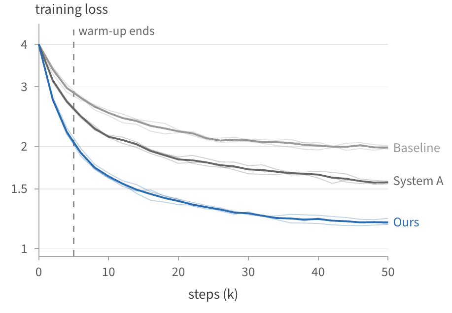

</div>
</div>

:::tip[获取方式]
样式包、模板、范例和脚本都在 GitHub 仓库 [HomuraT/tikz-paper-figure](https://github.com/HomuraT/tikz-paper-figure)。只用模板时取 `skills/tikz-paper-figure/assets/`（两个样式包、三个骨架、36 张范例的 `.tex` 源码与 PNG 渲染）和同级的 `scripts/`（八个 Python 脚本）两个目录，用法见下文「快速上手」。`skills/tikz-paper-figure/` 整个目录是一个 Claude Code skill：复制到 `~/.claude/skills/` 下，Claude Code 画图时会按 `SKILL.md` 与 `references/` 五份文档里的规范执行。仓库另有两个跑通的完整案例（`examples/`）和三条验收任务（`tests/`）。
:::

## 配图的一致性问题

一篇论文的图通常来自不同工具。先导图在 Visio 或 draw.io 里拖出来，实验曲线由 matplotlib 导出，榜单排名手工排版。每种工具有自己的默认字体、默认配色和默认线宽，拼进同一篇 PDF 之后差异很明显：正文是无衬线，图里是 DejaVu Sans；一张图里蓝色表示本方法，另一张图里蓝色表示基线。

代价还有两处。正文改了术语或数字，图要回到原工具重画一遍，源文件常常已经找不到。位图缩放之后字号跟着变，`\includegraphics[width=\linewidth]` 把 8pt 的标题压成 6pt，审稿人看不清。

## 常见做法及其局限

| 做法 | 局限 |
|---|---|
| Visio / PPT / draw.io 导出 PDF | 字体不随正文，源文件与论文仓库分离，改一个词要重新导出一次 |
| matplotlib 导出 PDF | 字体和数学符号需要额外配置，卡片式示意图不好画 |
| 位图截图 | 放大之后模糊，缩放改变字号 |
| 手写 TikZ，样式散在每个图文件里 | 十张图有十份配色，改一次要改十处 |

## standalone 图与样式包

每张图是一个独立的 `standalone` 文档，编译产出一个只有图那么大的 PDF，论文用 `\includegraphics{name.pdf}` 引入，不带 `width` 选项。图按正文宽度设计，编译尺寸就是最终尺寸，字号不会被缩放改动。

所有视觉决定集中在样式包里，图文件只负责摆放元素和填数据。卡片类样式在 `cardfig.sty`，数据图样式在 `plotfig.sty`，两个包共用同一套字体（Source Sans Pro 与 Inconsolata）和同一套调色板。

仓库里的 `skills/tikz-paper-figure/` 是 skill 本体，也是安装单元：

```text frame="none" showLineNumbers=false
   skills/tikz-paper-figure/
   ├── SKILL.md              工作流、设计规则、修订约定与交付规则
   ├── assets/
   │   ├── cardfig.sty       调色板、几何长度、图层、卡片与条形面板的宏
   │   ├── plotfig.sty       pgfplots 的 paper 坐标系样式、直接标注、参考线
   │   ├── template.tex      卡片骨架
   │   ├── template-bars.tex 条形面板骨架
   │   ├── template-plot.tex 折线图骨架
   │   └── examples/         36 张成品图，每张含 .tex 源码与 PNG 渲染
   ├── references/
   │   ├── gallery.md        36 张图一页总览，每张写它回答什么问题
   │   ├── principles.md     Wilke《Fundamentals of Data Visualization》的要点笔记
   │   ├── elements.md       每个构件的代码及其形状的依据
   │   ├── plots.md          图表选型、样式表、尺寸表、逐图配方
   │   └── pitfalls.md       编译与排版问题及其处理
   └── scripts/
       ├── check_env.py        列出本机缺哪些 TeX 宏包与工具，缺了影响哪个脚本
       ├── build_figure.py     编译、清理、宽度检查、渲染 PNG
       ├── bars_from_csv.py    结果 CSV 生成排序好的条形面板
       ├── flows_from_csv.py   记录型 CSV 生成平行集（流向图）
       ├── treemap_from_csv.py group,item,value 三列 CSV 生成树图
       ├── palette_check.py    色盲模拟与灰度下的配色距离
       ├── gallery_sheet.py    把全部范例渲染拼成一张总览图
       └── compare_sheet.py    改版前后的上下对照图
```

论文仓库要自带这两个 `.sty` 的副本。Overleaf 只从仓库编译，读不到本机 texmf 树下的文件。编译只用到 `assets/` 里的两个 `.sty`，`SKILL.md` 和 `references/` 是文档。

## 快速上手

环境是 TeX Live 与 Python 3。编译由 `latexmk` 调用 `pdflatex`，字体包 `sourcesanspro`、`inconsolata`、`fontawesome5` 在 TeX Live 的完整安装里都有；`pdfinfo` 与 `pdftoppm` 来自 poppler，只在检查页面尺寸和生成预览 PNG 时用到；`gallery_sheet.py` 另外依赖 Pillow。先跑一次 `scripts/check_env.py`，它把这些逐项查一遍，缺什么、缺了哪个脚本用不了都列出来。

1. 把 `assets/cardfig.sty` 和 `assets/plotfig.sty` 复制到论文仓库的 `figures/` 目录。
2. 从 `assets/examples/` 里挑与目标最接近的范例（下文每张范例图都能从选型表点到），复制为 `figures/name.tex`，替换数据与文字。没有合适范例时从 `assets/` 下的三个 `template*.tex` 骨架起手。
3. 在论文仓库根目录运行构建脚本。它切到图所在目录调用 latexmk，清掉辅助文件，打印页面尺寸与宽度判定，再把 PNG 预览写到 `--png-dir`：

   ```bash
   python path/to/tikz-paper-figure/skills/tikz-paper-figure/scripts/build_figure.py figures/name.tex --png-dir figures
   ```

4. 打开 PNG 看一遍，对照文末「构建与自检」的检查项修改。两三轮是正常的。
5. 主文件里写 `\graphicspath{{figures/}}`，正文用 `\includegraphics{name.pdf}` 引入，不带 `width` 选项。图按正文宽度设计，编译出来的尺寸就是最终尺寸。

## 四类模板的适用场景

1. **卡片式先导图**：一行卡片，每张卡一个论点，一条具体例子贯穿全部卡片。用于 Figure 1、方法总览、流程分解。形态取自 SWE-bench、Spider 2.0、BIRD 的 Figure 1。
2. **榜单条形图**：小面板网格，一个基准占一格，横向条按分数降序，本方法为亮蓝色。用于结果图。
3. **pgfplots 数据图**：折线带置信带、训练曲线、scaling law、分组柱、点图、消融条形、瀑布图、漏斗图、哑铃图、斜率图、胜负条、配对散点、Pareto 散点、ROC 与 PR、校准图、热力图、直方图、ECDF、密度图、山脊图、箱线图、抖动点、边缘直方图散点、堆叠占比、环形图、树图、平行集、雷达图。用于实验分析与数据集统计。
4. **多面板组合图**：小多图、共享横轴的上下双面板、局部放大插图、不同图型并排。用于一张图回答一组相关问题。

选型依据来自 Claus Wilke 的《Fundamentals of Data Visualization》，要点笔记在 `references/principles.md`，每节附原书章节链接。书的[导论](https://clauswilke.com/dataviz/introduction.html)对失败图有三档说法：**ugly** 只是不好看但读得懂，**bad** 是感知层面出了问题（含糊、误导），**wrong** 是数学上错了（条的长度对不上它的数值）。三档都不沾的图才算合格。

## 配色与字号

颜色承担语义，同一篇论文里含义固定，并在第一张图的图注或图例里说明一次。

| 名称 | 十六进制 | 含义 |
|---|---|---|
| `hdr` | 2D3748 | 标题栏、阶段箭头 |
| `kept` | 2B6CB0 | 目标一侧，以及保留、接受、抽取出的内容 |
| `addc` | DD6B20 | 难点所在：输入未给出的信息、某一步新增的元素、发生变化的单元格 |
| `dbA` | 2C7A7B | 数据源 A，或唯一的数据源 |
| `dbB` | 6B46C1 | 数据源 B，或第二类输入（例如候选集） |
| 灰 | black!35 描边 / black!7 填充 | 存在但不参与当前论点 |
| `barblue` | 007DFF | 条形面板、点图、箱线图、抖动点：本方法 |
| `bargrey` | E7E7E7 | 条形面板：其他系统的条 |
| `setpink` 等六色 | B96393 / 47A3E3 / EDE133 / 4FB477 / 8E6BC8 / EE8A3C | 半透明叠加用的浅色，见下 |

橙色 `addc` 每张卡只标一处。一张卡里有两处想标橙色，说明这张卡有两个论点，应当拆开或者删掉一个。

条形面板的两个颜色是从被模仿的榜单图上取样得到的，与卡片调色板不通用。卡片的深蓝 `kept` 放在浅灰条旁边发暗，取样得到的亮蓝 `barblue` 才对。

### 半透明叠加用浅色

平行集的色带、叠加的密度曲线、树图的分组各自要在重叠处混色。深色按 0.5 不透明度相加会发灰，所以这几张图不用调色板，改用 `setpink`、`setblue`、`setyellow` 等浅色，它们是从书里[嵌套比例一章](https://clauswilke.com/dataviz/nested-proportions.html)那张桥梁平行集上反推出来的底色：粉压蓝混出紫，蓝压黄混出绿。这类图里没有"本方法"，蓝色在其中不承载语义。

有序分组（模型规模、难度档）用同一色相的明度梯队，例如 `kept!25` 到 `kept!85`；无序分组才用不同色相。

### 色盲与灰度自检

```bash
python scripts/palette_check.py --sty figures/plotfig.sty --only kept,addc,dbA,dbB,gold
```

脚本按 Machado 2009 的矩阵模拟三类色盲，打出两两之间的 CIE76 色差与灰度明度。这套调色板在该模拟下的结果：蓝与橙在三类模拟里都保持可分；蓝与紫在绿色盲模拟下色差只有 15；橙与金在红绿色盲模拟下 2 到 6；五个色相的 L\* 全落在 40 到 58，黑白打印会变成同一片灰。模拟比较的是大色块，细线和小标记比色块更难分辨，Wilke 在[色彩陷阱一章](https://clauswilke.com/dataviz/color-pitfalls.html)专门提到这一点，所以定稿前还要看一遍灰度渲染和线宽。调色板没有为此改动，卡片依赖它，代价由实心标记与直接标注来补，颜色在任何一张图里都不做两个序列之间唯一的区别。Wilke 在[冗余编码一章](https://clauswilke.com/dataviz/redundant-coding.html)的意见是虚线和点线带来视觉噪声，并让读者多做一次线型与图例的匹配；本模板据此把数据线全画成实线，虚线只留给参考线。

字号：标题 8.5pt 粗体，正文 6.5 到 7pt，卡片底部的脚注带 6.3pt，下限 6pt。标识符（表名、列名、类名、文件名）用等宽字体，叙述文字用无衬线。

## 卡片式先导图


### 内容规划

写坐标之前先用几行字定下四件事，图的成败在这一步决定。

卡片数量与每张卡的唯一论点，标题是这个论点的一到三个词。卡片有两种编排：并列论点用编号徽标，与正文的列举一一对应，每张卡带一个橙色胶囊；流程阶段用普通标题，间隙里放阶段箭头，脚注带连起来读成一句话。

贯穿的例子取自论文里已有的清单、表格或示例，读者两次遇到同样的名字。例子要小，两张两三行的表，两三个类，一句话的文档。

橙色标注的对象是论文声称困难或新颖的那一处：输入没有声明的关联、没有字段承载的取值、某一步新增的元素、发生变化的单元格。其余元素保持蓝色、青紫或灰色。

脚注带写这张卡对照的是什么：早期工作的假设、输入、上一个阶段。一个短句，小写，无句点，6.3pt 下不超过 45 个字符。

### 几何预算

| 长度 | 默认 | 说明 |
|---|---|---|
| `\cardw` | 4.35cm | 阶段箭头需要更宽间隙时 3.95cm，两卡布局 4.8cm |
| `\cardh` | 4.45cm | 一张卡叠两张表时 4.8cm；按最高的那张卡设定一次 |
| `\cardgap` | 0.35cm | 带阶段箭头时 0.95cm |
| `\cardhh` | 0.6cm | 标题栏高度 |
| `\cardfh` | 0.5cm | 脚注带高度，`0pt` 去掉脚注带 |

5.5in 正文宽度下的横向预算是 `n*\cardw + (n-1)*\cardgap <= 13.8cm`，两种三卡配置都是 13.75cm。纵向可用区间从 `-\cardhh` 到 `-\cardh+\cardfh`；带胶囊时内容要止于 `-\cardh+\cardfh+0.55cm` 以上，不带胶囊时在脚注带上方留 0.25cm。

元素尺寸用来在写坐标之前先在纸上排一遍：

| 元素 | 尺寸 |
|---|---|
| 表格行 | 每行 0.28cm，表头计入 |
| 表格列 | 6.5pt 等宽字体每字符 0.105cm 再加 0.2cm，`New York City` 需要 1.55cm |
| 文档页 | 0.35cm 内边距 + 0.25cm 标签行 + 每行文字 0.28cm |
| 数据库圆柱 `\dbicon` | 缩放 1 时 0.3 x 0.45cm，缩放 0.72 时 0.22 x 0.32cm |
| 标签片、胶囊 | 高约 0.42cm；4.35cm 卡内胶囊约容 28 个字符 |
| 类框 | 表头 0.4cm + 每个属性行 0.26cm |
| 图例 | 7pt 每字符 0.11cm + 每个色块 0.46cm + `\legsep` 0.4cm |

决定布局的通常是最长的单元格取值和图例宽度。13 个字符的单元格放不进文档页旁边，四项图例放不到两张窄卡下面。

### 构件

```latex
\cardpanels{3}                         % P1 P2 P3，渐变标题栏、脚注带、边框
\cardheadn{P1}{1}{Issue}               % 编号徽标加标题
\cardhead{P2}{Entities}                % 无徽标的标题，用于流程阶段
\cardicon{P1}{bug}                     % 标题栏右端的淡白图标
\cardfoot{P1}{earlier work: the file to edit is given}
\cardpill{P1}{the issue names no file} % 橙色胶囊，各卡同一高度
\cardstage{P1}{P2}{extract}            % 跨间隙的阶段箭头，标签为小型大写
```

元素坐标一律相对自己所在的卡片书写，`($(P1.north west)+(0.3cm,-1.2cm)$)`。距卡片边缘留 0.25 到 0.3cm，有连接线沿左侧下行时左边留 0.9cm。

不要为了对齐把不同卡片里的元素强行放到同一坐标，那会在某张卡里留出大片空白。同类对齐更重要：胶囊等高（宏已保证），组标签在一张卡内成行，结果标签片与其来源的那一行齐平。

表格、标签片、问号徽标、文档页、代码框、类框各有对应的宏和 TikZ 样式。几条容易忽略的细节：

- 矩阵的每一列都要给 `text width`，否则不同内容的行高低不齐
- 单元格前加 `|[hi]|` 给它橙色边框和填充，用于故事所在的那个单元格
- 单元格名为 `<矩阵名>-<行>-<列>`，箭头连到 `aemp-1-3.east` 这样的锚点
- `drop shadow` 对矩阵和 `rectangle split` 节点无效，改用 `\boxshadow`
- 等宽字体里 `'` 渲染成右单引号，SQL 字符串要写 `\textquotesingle`
- `\\` 之后的前导空格会被丢弃，代码框内用 `~~` 缩进

流程图与输入输出对照的形态：


<div class="fig-wide">


</div>

## 榜单条形图

<div id="ex-bench-bars">


</div>

目标形态是 2 x 3 的面板网格，每格一个基准名加六行，每行是系统名、小图标、灰色条、末端的等宽分数。本方法的条为蓝色。整张图没有坐标轴、刻度和网格线，所有条共用一个刻度 `\barmax`（百分数用 100），所以某一格里的短条表示分数低，与坐标轴无关。

数字放进宽表 CSV，一行一个系统，一列一个基准，另有可选的 `icon` 列（`letter:K`、`fa:sun:addc`、`img:logos/x.pdf` 或原始 LaTeX）。数字从论文的结果表里取，图与表要精确到小数位一致。

```bash
python scripts/bars_from_csv.py results.csv --ours "Ours" --cols 2 --out figures/bars.tex
```

脚本把每格按分数降序排列（`--lower-better "Latency"` 用于越小越好的指标），把 `--ours` 指定的系统涂蓝，并从数据算出名字列宽、面板行距和 `\barmax`。面板按 CSV 的列顺序从左到右、再向下填充，调整列序即调整面板顺序。

### 面板参数

| 长度 | 默认 | 说明 |
|---|---|---|
| `\barpanelw` | 6.6cm | 三列时 4.2cm；最长的条的数值标签在这个宽度处结束 |
| `\barcolgap` | 0.6cm | 面板列间距 |
| `\barpanelpitch` | 2.75cm | 面板行距，等于 `\bartitlegap` + 行数 * `\barrowpitch` + 0.5cm |
| `\barnamew` | 1.6cm | 名字列，7pt 每字符 0.115cm 再加 0.15cm |
| `\bariconw` | 0.4cm | 图标列，无系统带图标时设 `0pt` |
| `\barvaluew` | 0.7cm | 满长条之后留给数值标签，四位数或带剑标用 0.85cm |
| `\barrowpitch` / `\barh` | 0.3cm / 0.17cm | 行距与条的厚度 |
| `\bartitlegap` | 0.45cm | 标题顶部到第一根条中心 |

手写面板用同一套宏：

```latex
\begin{barpanel}{0}{0}{Code Repair}                     % {列}{行} 从 0 开始，然后是标题
  \barrow{Sol 3}{\iconfa[addc]{sun}}{73.0}              % 行按分数降序
  \barrow[ours]{Ours}{\iconletter{O}}{67.5}             % 蓝色条
  \barrow[ours2]{Ours (no retrieval)}{}{61.0}           % 橙色条，无图标
  \barrow{Vega}{\iconletter[black!60]{V}}{46.2}[46.2$^\dagger$]
\end{barpanel}
\begin{barpanel}[10]{1}{0}{Latency (s)} ... \end{barpanel}  % 这一格在 10 处满格
```

`\barrow` 的数值参数必须是纯数字，剑标、百分号和 `--` 写进末尾的可选标签。某个系统缺这一项分数时省掉这一行，不要画零长的条。排序只按显示的数值，行本身是有序变量时（模型规模、难度档）改用 `--keep-order` 保留原顺序。系统没有 logo 就把图标留空，不要编一个。

某一格里所有数值都挤在窄区间时（最短的条超过最长的条的七成），从零起画的条彼此看不出差别，这一格应该改成截断坐标轴的点图，见下一节的 `dots`。

面板与卡片的差异：没有阴影，没有边框，文字为黑色，配色是上面那两个取样色。`ours2` 用橙色 `addc`，留给正文单独提到的第二个系统，例如某个消融配置。

## pgfplots 数据图

`plotfig.sty` 的 `paper` 坐标系样式把 PGF 手册和 Tufte 的建议固化下来：只画左侧和底部轴线，横向浅网格，刻度标签灰色，数字用正文字体，y 轴标签水平放在坐标系上方，序列名标在线的末端，一个系统在全篇用同一个颜色。

### 图表选型

先看段落要回答什么问题，数据类型本身决定不了图型。表按问题分组，文件名指向范例。

**数量与对比**

| 段落要回答的问题 | 图表 | 范例 |
|---|---|---|
| 少数系统在少数基准上的绝对数值对比 | 分组柱，每根柱上印数值 | [`grouped-bars`](#ex-grouped-bars) |
| 本方法在众多基准上的排名 | 条形面板，见上一节 | [`bench-bars`](#ex-bench-bars) |
| 数值都挤在窄区间里时的排名 | 截断坐标轴的点图，数值印在点旁 | [`dots`](#ex-dots) |
| 从完整系统里去掉某个部件，损失多少 | 消融条形，末端印分数与下降量，满配处一条参考线 | [`ablation`](#ex-ablation) |
| 从基线逐步加上各部件，怎么累加到最终分数 | 瀑布图，首尾是从零起的整条，中间是悬浮的增量 | [`waterfall`](#ex-waterfall) |
| 数据构建的每个阶段还剩多少 | 漏斗条，按流程顺序排列，印计数与留存率 | [`funnel`](#ex-funnel) |
| 各系统犯多少错，错在哪类 | 堆叠计数条，总数印在每叠之上 | [`stacked-counts`](#ex-stacked-counts) |

**增益与配对数据**

| 段落要回答的问题 | 图表 | 范例 |
|---|---|---|
| 在十项以内的基准上相对基线提升了多少 | 哑铃图，须是增益的置信区间 | [`dumbbell`](#ex-dumbbell) |
| 逐题看是否都有提升，还是整体平移 | 配对散点加 x = y 线，不画网格 | [`parity`](#ex-parity) |
| 两种条件之间谁涨了谁跌了，各多少 | 斜率图，一系统一条线，名字在左值在右 | [`slope`](#ex-slope) |
| 与各对手两两比较的胜率 | 居中的胜平负条，平局压在零上，胜向右负向左 | [`win-tie-loss`](#ex-win-tie-loss) |

**随有序横轴的趋势**

| 段落要回答的问题 | 图表 | 范例 |
|---|---|---|
| 若干系统的分数随数据量、算力或时间如何增长 | 折线加置信带，末端直接标名 | [`curves-bands`](#ex-curves-bands) |
| 训练怎么收敛，不同随机种子散多少 | 对数纵轴的损失曲线，各次运行淡线压在均值之后 | [`training-curves`](#ex-training-curves) |
| 某指标是否服从幂律，能否预测下一个点 | 双对数散点，拟合线只画在拟合区间内，留出点画空心标记 | [`scaling-law`](#ex-scaling-law) |
| 哪些系统的开销与质量相称 | 开销对质量散点加 Pareto 前沿 | [`pareto`](#ex-pareto) |

**分类器质量**

| 段落要回答的问题 | 图表 | 范例 |
|---|---|---|
| 假正例与召回如何取舍，正例稀少时谁更好 | ROC 与 PR 并排，AUC 写进标注，随机水平为参考线 | [`roc-pr`](#ex-roc-pr) |
| 模型给出的置信度是否诚实 | 可靠性图，各置信区间的准确率对 x = y 线，印出 ECE | [`calibration`](#ex-calibration) |

**分布**

| 段落要回答的问题 | 图表 | 范例 |
|---|---|---|
| 某个统计量怎么分布（长度、每组条目数） | 直方图，小整数时一格一根柱 | [`histogram-ecdf`](#ex-histogram-ecdf) (a) |
| 重尾统计量在各系统上怎么分布 | 对数横轴的 ECDF，直接标名 | [`histogram-ecdf`](#ex-histogram-ecdf) (b) |
| 两三个分组之间同一统计量的差别 | 叠加的半透明密度曲线，峰顶标名，不要纵轴 | [`densities`](#ex-densities) |
| 沿有序变量看分布怎么移动，四档以上 | 山脊图，纵轴承载分组名 | [`ridgeline`](#ex-ridgeline) |
| 每个系统数十条目的分数怎么散 | 箱线图，本方法为蓝 | [`boxplots`](#ex-boxplots) |
| 每个系统只有几次运行时怎么散（n 小于十） | 抖动点加四分位框与中位线 | [`strips`](#ex-strips) |
| 两个变量的关系，同时看各自的分布 | 散点加两侧边缘直方图 | [`scatter-margins`](#ex-scatter-margins) |

**构成与占比**

| 段落要回答的问题 | 图表 | 范例 |
|---|---|---|
| 每个分组由什么构成，只关心占比的漂移 | 100% 堆叠横条，每段印百分数 | [`stacked-100`](#ex-stacked-100) |
| 数据集的单维构成，最多四块 | 环形图，总数放在中心 | [`donuts`](#ex-donuts) |
| 两层嵌套的分类变量怎么切分总体 | 树图，分组给色相，条目给明度，印出数字 | [`treemap`](#ex-treemap) |
| 三个以上分类变量之间怎么对应 | 平行集，色带按最左变量着色 | [`flows`](#ex-flows) |

**矩阵与多维度**

| 段落要回答的问题 | 图表 | 范例 |
|---|---|---|
| 任意方阵，例如每个源到每个目标的迁移，或超过三十个数的表 | 带数字的热力图，行按明确的准则排序 | [`heatmap`](#ex-heatmap) |
| 多项能力上的整体形状对比 | 雷达图，仅在正文讨论形状时使用 | [`radar`](#ex-radar) |

印了数值的柱状图不需要 y 轴。带末端标注的折线图不需要图例。热力图在读者要引用其中数字时才把数字印上去。雷达图是伪装的图例，系统不超过三个，轴不超过六条。散点上的第三个数值变量写成标签或另开一格，不要用气泡大小，也不要加第三个轴。横轴不构成顺序时不要连线，改画柱或点。同一横轴上的两个量画成上下两格，不画双纵轴。

### 范例

分组与上面的选型表一致，图按论文里的设计宽度等比显示，半栏宽的图两两并排，点击看原图。`references/gallery.md` 把全部 36 张排成一页，每张写它回答什么问题，`scripts/gallery_sheet.py` 把它们拼成一张总览图。

**数量与对比**

<div class="figrow">
<div id="ex-grouped-bars">


</div>
<div id="ex-dots">

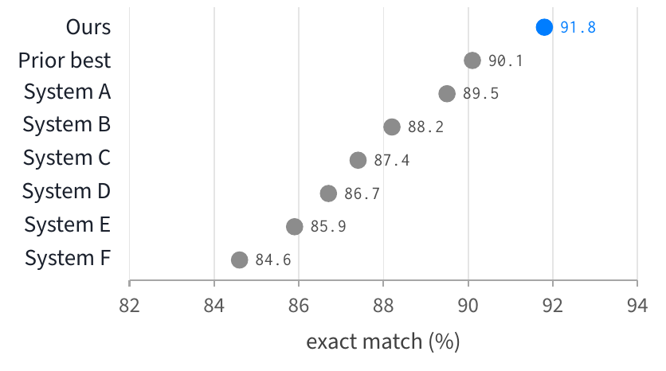

</div>
</div>

<div class="figrow">
<div id="ex-ablation">

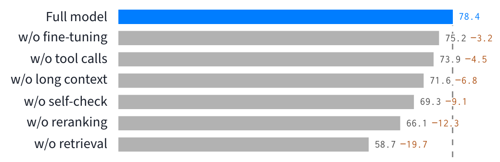

</div>
<div id="ex-waterfall">

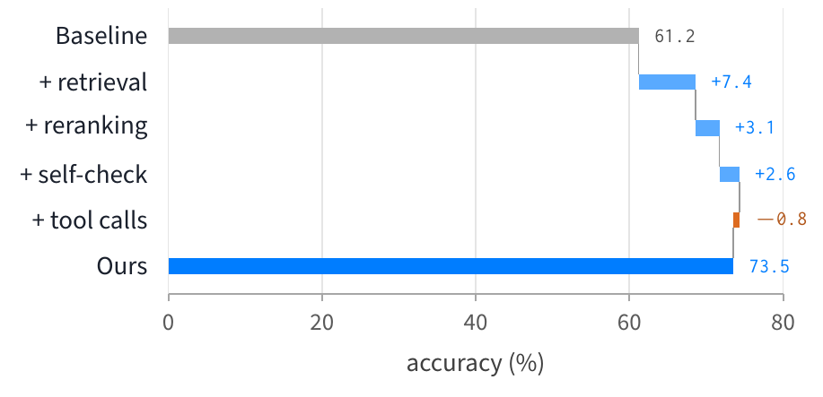

</div>
</div>

<div class="figrow">
<div id="ex-funnel">

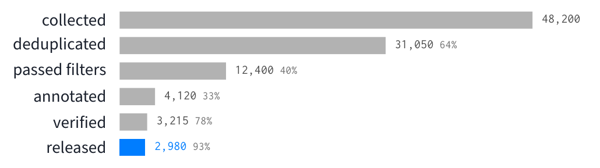

</div>
<div id="ex-stacked-counts">

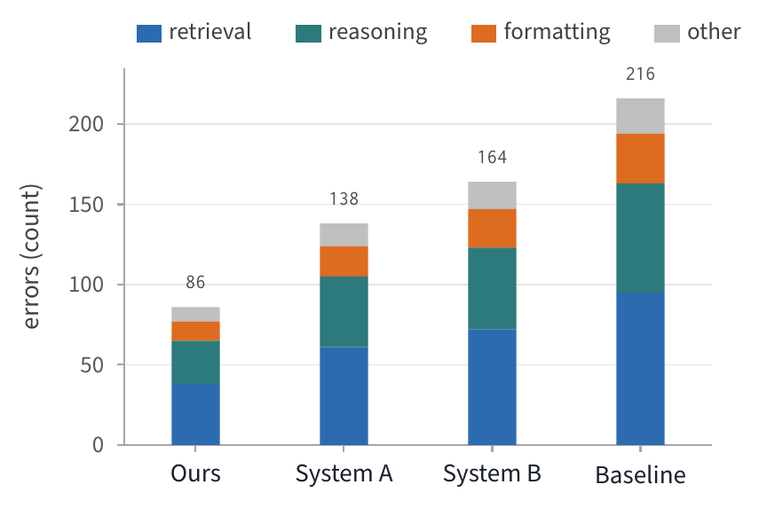

</div>
</div>

**增益与配对数据**

<div class="figrow">
<div id="ex-dumbbell">


</div>
<div id="ex-parity">

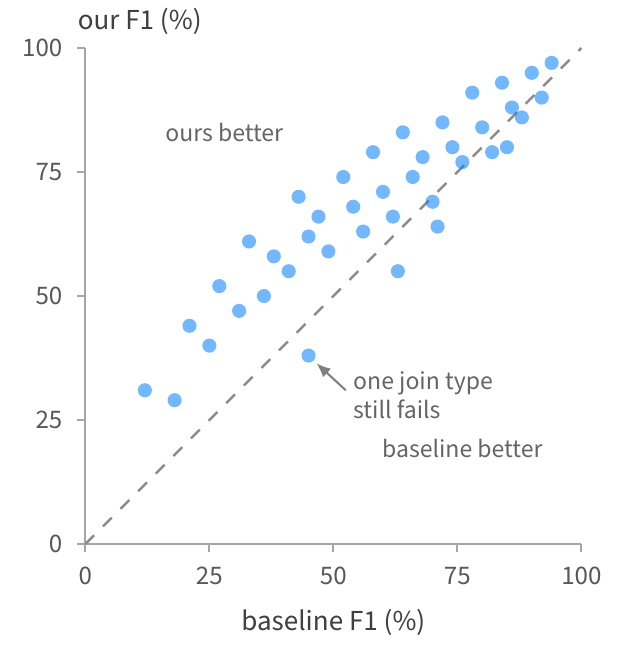

</div>
</div>

<div class="figrow">
<div id="ex-slope">

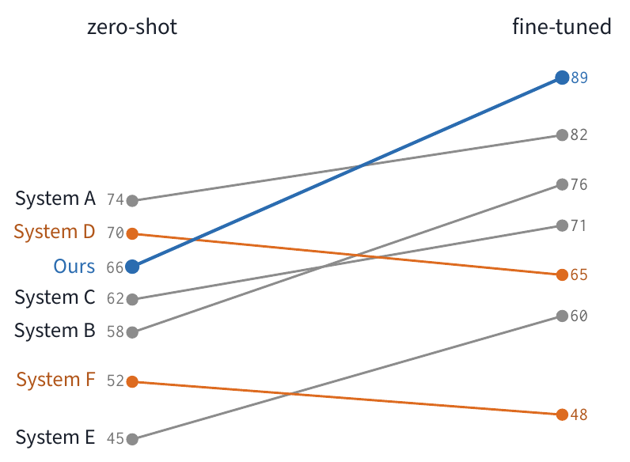

</div>
<div id="ex-win-tie-loss">

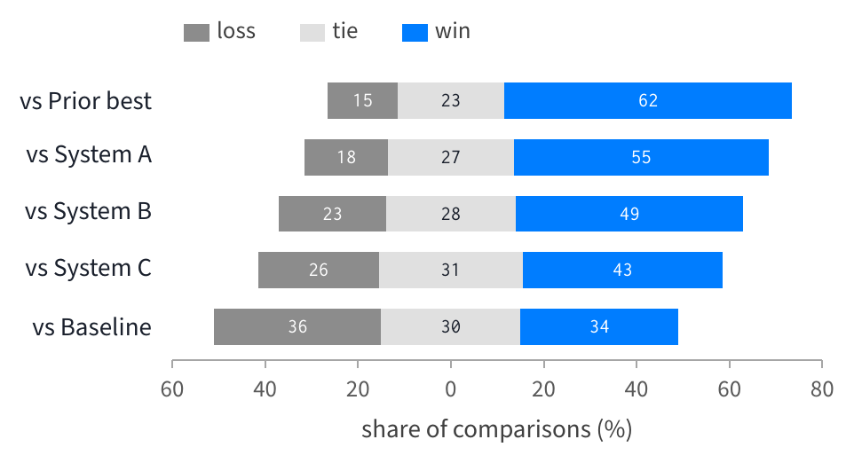

</div>
</div>

**随有序横轴的趋势**

<div id="ex-curves-bands">


</div>

<div class="figrow">
<div id="ex-training-curves">


</div>
<div id="ex-scaling-law">

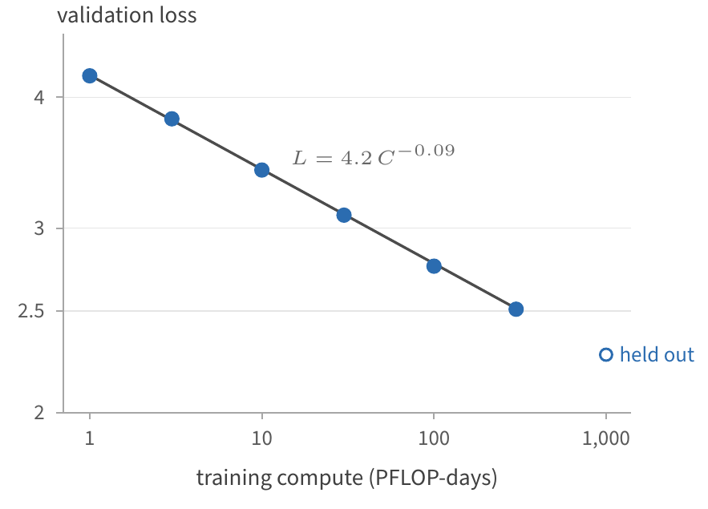

</div>
</div>

<div id="ex-pareto" class="fig-half">


</div>

**分类器质量**

<div id="ex-roc-pr" class="fig-wide">

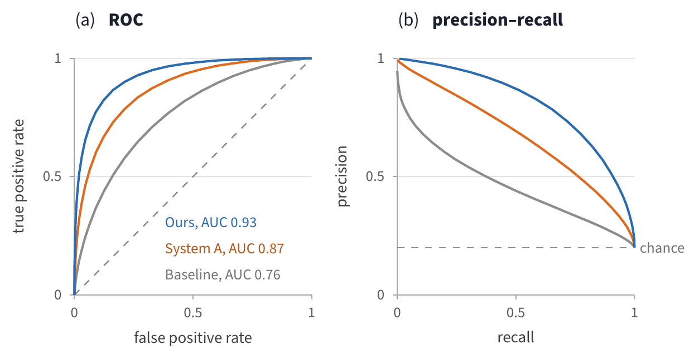

</div>

<div id="ex-calibration" class="fig-half">

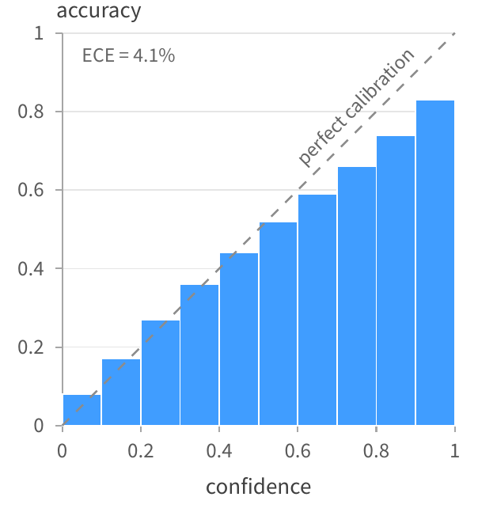

</div>

**分布**

<div id="ex-histogram-ecdf">

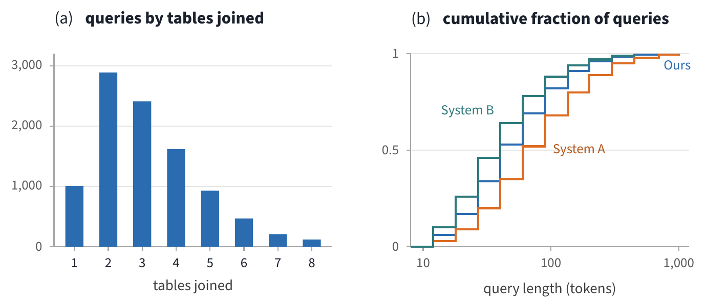

</div>

<div class="figrow">
<div id="ex-densities">

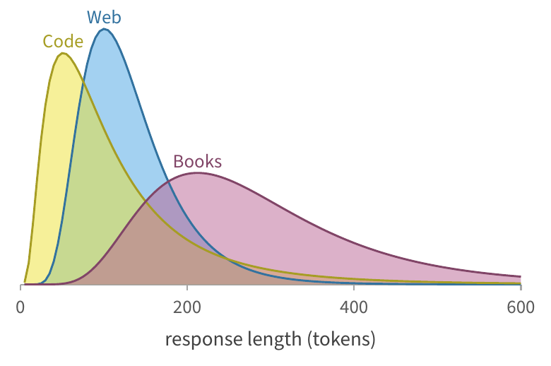

</div>
<div id="ex-ridgeline">

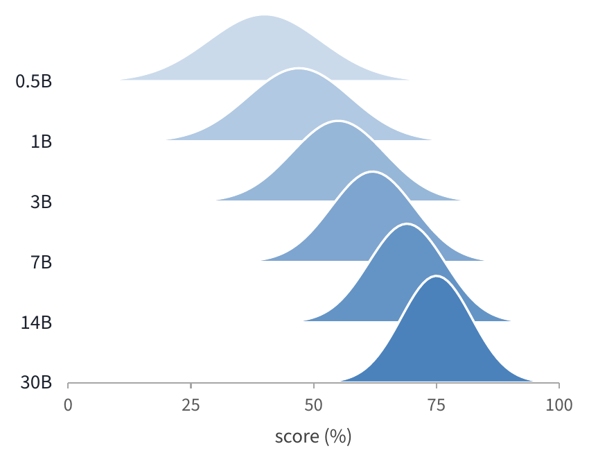

</div>
</div>

<div class="figrow">
<div id="ex-boxplots">

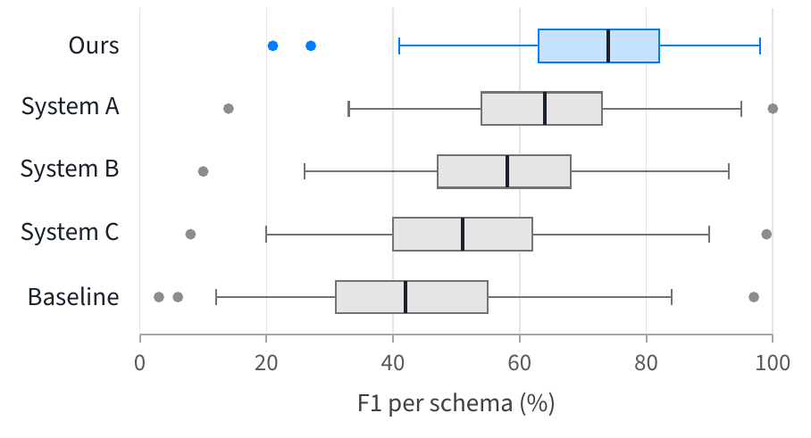

</div>
<div id="ex-strips">

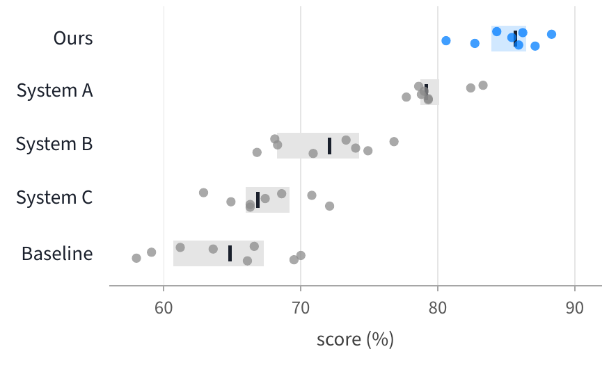

</div>
</div>

<div id="ex-scatter-margins" class="fig-half">

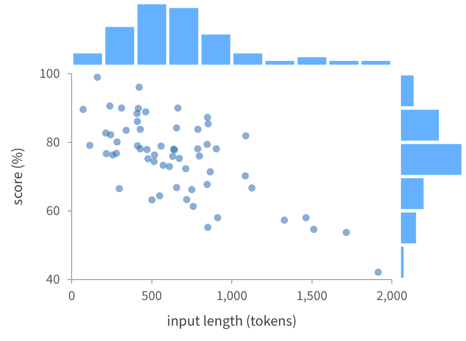

</div>

**构成与占比**

<div id="ex-stacked-100" class="fig-wide">


</div>

<div id="ex-donuts">


</div>

<div id="ex-treemap" class="fig-half">

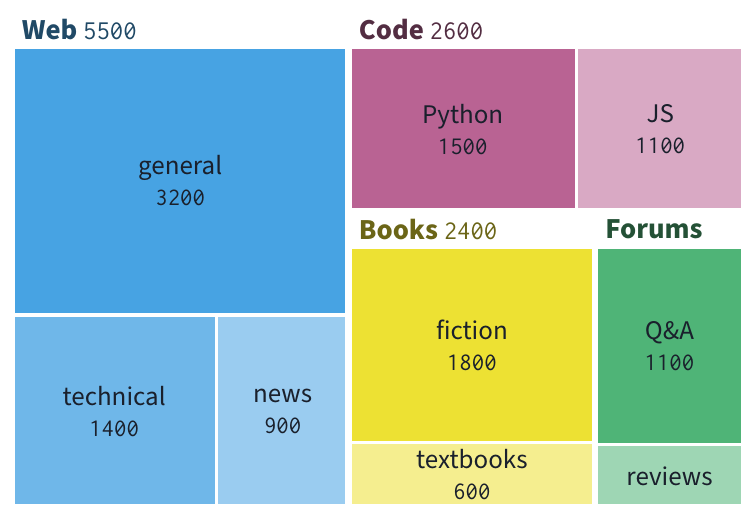

</div>

<div id="ex-flows">


</div>

**矩阵与多维度**

<div class="figrow">
<div id="ex-heatmap">


</div>
<div id="ex-radar">


</div>
</div>

### 尺寸

| 用途 | 坐标系尺寸 |
|---|---|
| 双栏图中的单图 | 宽 6cm，高 4cm |
| 并排两格（`groupplots`） | 宽 4.9cm，高 3.5cm，`horizontal sep=1.15cm` |
| 通栏柱状图 | 宽 9.4cm，高 3.2cm，`bar width=0.3cm` |
| 点图、哑铃图 | 每行 0.32cm，宽 5.4 到 6.2cm，`ymin=0.4`、`ymax=行数+0.6` |
| 消融、漏斗 | 每行 0.38cm，宽 6cm，最长条之后留 1.6cm 给数值与后缀 |
| 瀑布图 | 每行 0.4cm，宽 5.8cm，六行为 2.7cm |
| 胜平负条 | 每行 0.54cm，宽 6.2cm |
| 堆叠计数柱 | 宽 5.6cm，高 3.6cm，总数需要约 6% 的顶部余量 |
| 箱线图、抖动点 | 每行 0.5cm / 0.65cm，宽 6cm |
| 密度图 | 宽 6cm，高 3.4cm，无纵轴 |
| 山脊图 | 六道时宽 6cm，高 4.6cm，基线间距 0.6，脊高 0.9 |
| 斜率图 | 两列相距 4.6cm，高 4.4cm，同列端点至少错开 0.3cm |
| 配对散点、校准图 | 宽高各 4.2cm，两轴范围相同 |
| ROC 与 PR | 两个 3.6cm 方格，`horizontal sep=1.3cm` |
| 边缘直方图散点 | 主图 5.3 x 3.4cm，边缘 1.1cm，间隙 0.15cm |
| 热力图 | 6 x 6 时宽高各 4.6cm，色带另加 0.9cm |
| 堆叠横条 | 四行时宽 8.6cm，高 2.5cm |
| 树图 | `--width 6.2 --height 4.2`，组标题条 0.3cm |
| 平行集 | `--height 5.4 --col-gap 3.7`，四变量共 12.1cm |
| 雷达图 | 4.6cm，四周标签另占约 1cm |
| 小多图 | 每格 3.5 x 2.4cm，`horizontal sep=0.5cm`，`vertical sep=1.1cm` |
| 上下双面板 | 宽 6cm，高 2.6cm 与 2.0cm，`vertical sep=0.65cm` |
| 局部放大插图 | 6 x 4cm 坐标系内放 2.3 x 1.5cm，刻度 5.5pt |
| 三格并排 | 高 3.2cm，宽 3.8 / 4.0 / 3.2cm，间隙 1.35cm，共 13.8cm |

`scale only axis` 使 `width` 和 `height` 指坐标系本身，标签和图例叠在其之上。尺寸在图文件里定，引入时用原尺寸。

### 配方

置信带是两条不可见路径加一次填充，画在折线之前，折线才会压在带子上面：

```latex
\addplot[name path=u, draw=none, forget plot] coordinates {...上界...};
\addplot[name path=l, draw=none, forget plot] coordinates {...下界...};
\addplot[band, fill=kept] fill between[of=u and l];
```

`band` 样式是半透明填充，两条带子重叠的地方仍能看出各自的边界。图注要写清带子是什么：五个种子在每个 x 上的 95% 置信区间，或者拟合的 95% 置信带（后者呈沙漏形）。种子只有几个时改画 `runs`，把每次运行画成淡细线压在均值之后，比带子更诚实。

末端标注写成 `\addplot ... coordinates {...} node[dl, text=kept] {Ours};`。`paper` 样式带 `clip=false`，标签可以挂在坐标系之外，standalone 的页面会跟着长大。要把标签收在坐标系内就给出明确的 `xmax`：`enlarge x limits` 只对自动范围生效，而且写法是 `enlarge x limits={upper, value=0.4}`，写成 `upper=0.4` 时数字被静默忽略、按默认的 0.1 处理，同一选项列表里第二次 `enlarge x limits` 还会覆盖第一次。两条线的末端相距 4pt 以内时，一个标签加 `yshift=3pt`，另一个加 `yshift=-3pt`。

对数轴写成 `xmode=log, log ticks x`（`ymode` 同理）。`xmode` 必须写在坐标系自己的选项里，pgfplots 在任何样式生效之前就要扫到它，藏进样式或 `\nextgroupplot` 会报 "you can't change xmode in this context"。`log ticks x` 让刻度按数值显示（10、100、1000，损失轴上的 1.5、2、2.5），不显示指数。对数轴上不放柱，也放不了零：失败和超时的点要么改线性轴，要么标在坐标系之外并在图注里说明。

参考线用于人类水平、随机水平或此前最好成绩：

```latex
\addplot[ref, forget plot] coordinates {(0,86) (100,86)} node[dl, text=black!55] {human};
```

热力图用 `matrix plot*` 加 `point meta=explicit` 和 `y dir=reverse`，单色 colormap 写成 `colormap={paperblues}{color(0cm)=(white); color(1cm)=(kept)}`，`point meta min/max` 固定，过半的单元格用白字，网格线为 1pt 白线。

柱上的数值由 `bars labelled` 加 `nodes near coords` 印出，基线被钉在零。横向柱要在 plot 上补 `point meta=x`，否则印出来的是行号而不是数值。要按表里的原文印（并且能用 `\ifnum` 判断），读法是 `visualization depends on={value \thisrow{v} \as \cellv}`。

消融图的下降量是表里的一列文本，用 `visualization depends on={value \thisrow{d} \as \dropv}` 读出，拼在分数之后：`nodes near coords={\pgfmathprintnumber{\pgfplotspointmeta}\hspace{2pt}\textcolor{addctext}{\textminus\dropv}}`。满配处的参考线先画，数值节点带 `fill=white, inner xsep=1.5pt`，虚线在数字处自然断开。漏斗图同理，留存率是一列文本，首行给一个空的 `{}` 单元格。

瀑布图和胜平负条不用 bar plot：先用一条不可见的 `\addplot` 把范围钉住，再在 `axis cs` 里画矩形。瀑布图的增量从上一行的累计值起画，正为蓝负为橙，行与行之间用细灰线接住累计值。胜平负条的每行三段：平局从 −t/2 到 t/2，负从 −t/2−l 到 −t/2，胜从 t/2 到 t/2+w；刻度用 `xticklabel={\pgfmathparse{abs(\tick)}\pgfmathprintnumber{\pgfmathresult}}` 印绝对值，窄于约 6% 的段不印数字。

密度曲线的填充与描边是两个 plot：`\closedcycle` 会连着基线一起描边，所以填充用 `draw=none` 加 `\closedcycle`，描边单独再画一次，先画高的再画低的，重叠处才混得干净。山脊图的每道脊坐在自己的基线上，`\closedcycle` 会闭合到 y=0，要手写收尾路径 `-- (axis cs:100,b) -- (axis cs:0,b) -- cycle`；从最上一道往下画，下面的压住上面的，之间留 0.8pt 白色描边，坐标系加 `axis on top` 保住底部的横轴线。

校准图的柱用 `ybar interval`，坐标是各区间的边界（最后一个 y 值被忽略）。`ybar interval` 写在 plot 上而不是坐标系上，之后画的 `ref` 对角线才仍是一条线。

边缘直方图是三个坐标系：主图取 `name=main`，上方那个用 `at={(main.north west)}, anchor=south west, yshift=0.15cm` 并沿用同样的 `width` 与横轴范围，右侧那个用 `(main.south east)` 加 `xshift` 并沿用高度与纵轴范围，两者都 `axis lines=none`。`paper` 带 `scale only axis`，锚点就是绘图矩形，三块自然对齐。

斜率图只有两个横坐标位置，标注挂在路径上：`node[pos=0, dl, anchor=east] {名字}` 与 `node[pos=1, dl, mono] {数值}`。

平行集与树图由脚本生成，不手写坐标：

```bash
python scripts/flows_from_csv.py records.csv --col-gap 3.7 --height 5.4 --out figures/flows.tex
python scripts/treemap_from_csv.py data.csv --width 6.2 --height 4.2 --out figures/treemap.tex
```

平行集的输入是记录型 CSV，表头即各分类变量的列顺序，可选的 `count` 列给这一组记录的条数。形态照书里的桥梁图：每个节点是灰条，类别名竖排在条内，变量名写在每列下方，色带一律按最左变量着色，并在每个节点内先按颜色分组再按另一端排序，同色因此相邻、交叉最少。读者要追的那个变量放最左；一两条记录的类别会细成头发丝，先合并掉。三列源、目标、数量的边列表用 `--edges`，此时中间节点的出流按入流比例分摊，只有给记录才是精确的。

树图的输入是 `group,item,value`，布局用 squarify，分组按总量、组内按数值排列，分组给色相、条目给明度，名字与数字放不下时自动降级为只印名字或不印，组名与总量放在组上方的白色标题条里。放不下的小条目先并成 "other" 再画。

注释每张图最多一处，用 `note` 加 `notearrow`，写正文正在讨论的那个发现。

## 多面板组合图

一张图回答一组相关问题时，几格画在同一个 standalone 里，坐标系与基线才能对齐，图例也只要一份。同类图型的网格是小多图，各格靠标题区分，不加 (a)(b) 字母；不同图型并排才用 `\plab` 编字母，图注按字母逐格交代。

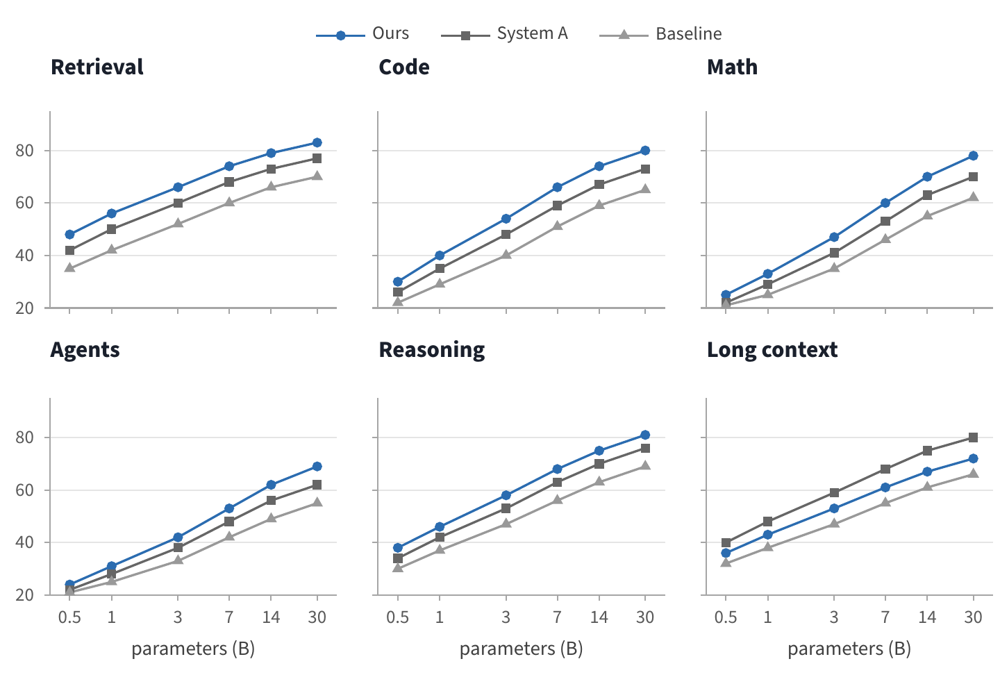

小多图的共享项（`xmode`、刻度、`ymin`/`ymax`、轴标题）写在 `groupplot` 环境上，每个 `\nextgroupplot` 只带自己的数据与标题，刻度标签靠 `x descriptions at=edge bottom` 与 `y descriptions at=edge left` 收到外缘。图例只在第一格生成一次：那一格写 `legend to name=smlegend` 并逐个 `\addlegendentry`，网格之后用 `\node[anchor=south] at ($(group c2r1.north)+(0,0.55cm)$) {\pgfplotslegendfromname{smlegend}};` 摆出来。纵向间距要够放下下一行的标题。

<div class="figrow">
<div>

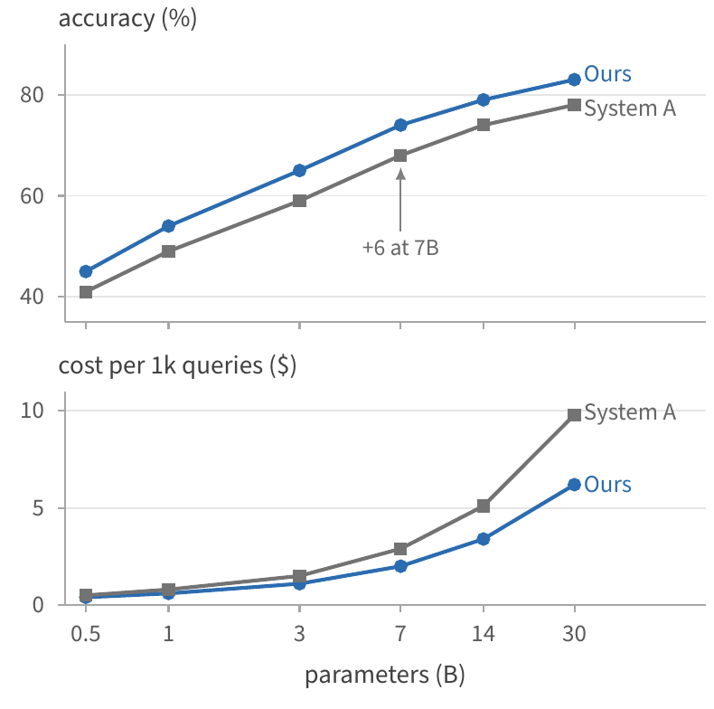

</div>
<div>

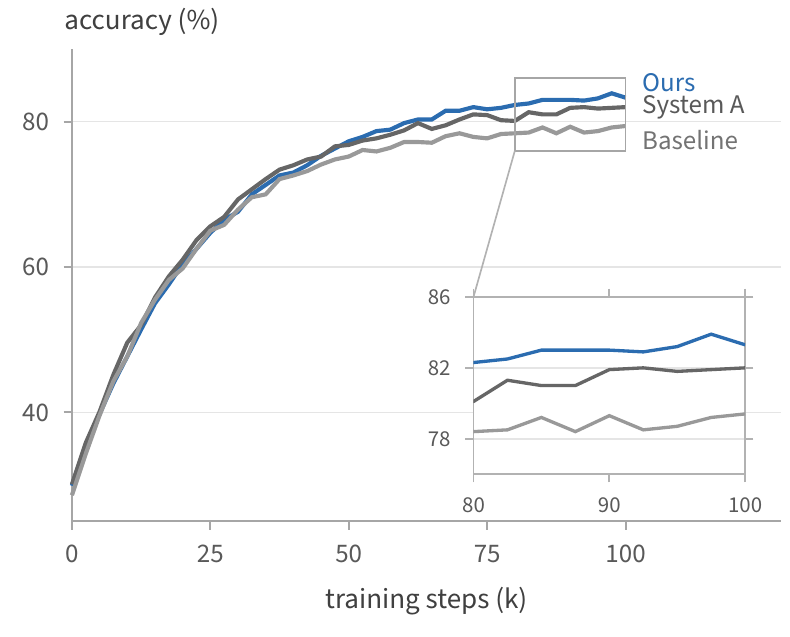

</div>
</div>

同一横轴上的两个量画成上下两格，横轴在底部设一次（`x descriptions at=edge bottom`），每格自己设高度、纵轴范围和 `y label top`。这是双纵轴图的替代画法，书里不用双纵轴。

插图是第二个坐标系，用 `at={(main.south east)}, anchor=south east` 加位移摆进主图，要 `clip=true`（`paper` 默认 `clip=false`）、白色背景、`axis lines*=box` 的细灰边框和 5.5pt 刻度，曲线颜色与主图一致。主图上用细灰矩形标出被放大的区间，连接线在两个坐标系都画完之后再从存好的 `\coordinate` 画出。插图压住曲线时换一个角。

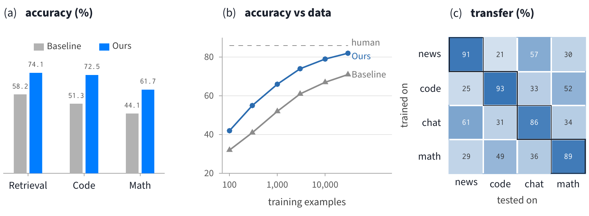

不同图型不能共用 `groupplot`，因为 `xmode` 不能逐格切换。改成三个各自命名的坐标系，第二第三个用 `at={($(a.south east)+(1.35cm,0)$)}, anchor=south west` 摆放，锚点是绘图矩形，标签再长也不影响顶底对齐。某一格的末端标注要收在自己宽度内，否则会伸进下一格的行名。标题占了左上角，图例改放绘图区内顶部（`legend style={at={(0.5,1)}, anchor=north}`），并留出顶部余量。

## 构建与自检

```bash
python scripts/build_figure.py figures/name.tex --png-dir /tmp/cardfig
```

脚本在图所在目录调用 latexmk，清掉辅助文件，打印页面尺寸并给出宽度判定，再把第一页渲染成 PNG。编译出错时打印 `!` 开头的行和定位用的 `l.NN` 行。

每一轮都要打开 PNG 看一遍，日志不显示重叠、断词和错位。检查项：

- 没有元素接触或越过卡片边缘，脚注文字两侧留白
- 文档页和胶囊里没有断词
- 表格行高一致，高亮单元格的边框没被相邻单元格裁掉
- 箭头从正确的锚点出发和到达，中途不穿过标签或其他单元格
- 右侧和下方的阴影完整
- 宽度判定为 `ok`，5.5in 正文宽度下三张 4.35cm 卡片加 0.35cm 间隙是上限
- 图例没有超出卡片行的外缘，宽度判定看不出这一项
- 刻度标签和印出的数值不是 Computer Modern 字体
- 折线和柱压在置信带、网格与色块之上
- 从零起画的是柱和填充，截断的范围只给点和线用，并保留坐标轴
- 对数轴按数值读，不含零，上面没有柱
- 每个序列在图上有名字，灰度打印时还能靠标记或标注区分，只有参考线是虚线
- 每条须和每个带子在图注里写明是什么量、什么水平、n 多少
- 有序变量（模型规模、难度档）保持自己的顺序，不按数值重排
- 组合图各格顶底对齐、共享刻度，图例只有一份，某格例外时图注要说

两三轮迭代是正常的。改版时把新版写成 `name2.tex`，旧文件保留，再生成一张上下对照图交给读者比较：

```bash
python scripts/compare_sheet.py --out /tmp/before-after.png "before=figures/name.pdf" "after=figures/name2.pdf"
```

引入论文时不带 `width` 选项，主文件里写 `\graphicspath{{figures/}}`。图注给出读图钥匙（颜色的含义、脚注带是什么）以及图本身推不出的结论，不复述胶囊和标题。重新编译论文后查 `grep -c Overfull main.log`，超宽 0.5pt 只在这里显形。源文件与产出的 PDF 一起提交。

## 常见错误

| 现象 | 原因与处理 |
|---|---|
| 用 `\tikzmarknode` 定位的节点每次编译都在动 | 标记坐标来自上一遍的 `.aux`。凡从标记定位的节点和路径都要加 `overlay`，图片加 `remember picture` |
| calc 表达式内部用标记坐标做垂直对齐，位置错误且不报错 | 先 `\coordinate (bx) at (...)` 取出偏移点，再对 `bx` 做对齐 |
| 图只超宽 0.5pt，只有论文的 log 报 Overfull | pdftex 看到的宽度比 `pdfinfo` 报的约大 1.5pt。三张 4.35cm 卡片时 standalone 的 `border` 左右合计最多 4pt |
| 阴影在右侧或下方被切掉 | 阴影不计入 bounding box，这是 3pt 右边距和 3.5pt 下边距的用途，不要调小 |
| 文档页里的单词断行 | `doc` 样式已关掉断词。仍然溢出就缩短句子或加宽 `text width`，不要重新打开断词 |
| `\end{axis}` 处报 `Illegal parameter number in definition of \tikz@scan@point@coordinate` | 坐标系内的路径到 `\end{axis}` 才执行，`\foreach` 的变量已失效。改用 `\pgfplotsinvokeforeach` |
| 印出的数值成了 `91.000000000` | 写 `visualization depends on={value \thisrow{v} \as \cellv}`，`value` 保持单元格原文 |
| 横向柱印出来的是 1、2、3 而不是数值 | `nodes near coords` 读的是 y 坐标，在 `xbar` 上就是行号。plot 上补 `point meta=x` |
| `enlarge x limits={upper=0.4}` 没有效果，或效果不是写的那个数 | `upper` 是开关，数字被忽略、按默认 0.1 处理；同列表里第二次调用覆盖第一次；给了明确的 `xmin`/`xmax` 时这个键完全失效。写 `enlarge x limits={upper, value=0.4}`，或直接把 `xmax` 留够 |
| 样式里写了 `xmode=log` 报 `you can't change xmode in this context` | pgfplots 在样式生效前就扫坐标系选项找 `xmode`。它只能写在 `axis` 或 `groupplot` 自己的选项里，`\nextgroupplot` 也不行；要逐格切换轴型就改成两个 `axis`，用 `name=` 与 `at=` 摆放 |
| 样式里用了 `/pgf/number format/.cd`，之后的键报找不到 | `.cd` 会把默认键路径泄漏给同一选项列表里后面的键。写全路径 `/pgf/number format/precision=1` |
| 对数轴上 2.5 的刻度印成 2.4998 | pgfmath 的 `10^x` 只精确到约四位。`log ticks` 样式按三位有效数字打印规避，仍不对就为那个坐标系手写 `yticklabels` |
| 填充的密度曲线连着基线一起被描边 | `\closedcycle` 会闭合并描边基线。填充与描边分成两个 plot，描边那个不带 `\closedcycle`；坐在自己基线上的山脊要手写收尾路径 |
| `\mono` 报未定义 | `mono` 是节点样式（`\node[mono]`），不是宏。节点文字里混排数字时用 `\ttfamily` |
| 抖动点的中位线不见了 | 它画在点之前被盖住了。顺序是四分位框、点、中位线 |
| groupplot 里出现两份图例或一份都没有 | `legend to name` 与 `\addlegendentry` 只写在第一格，网格之后用 `\pgfplotslegendfromname` 摆出来 |
| 插图显示的是整条曲线，或者没有边框 | 插图坐标系要 `clip=true`（`paper` 默认 `clip=false`）、`axis lines*=box`、白色背景，连接线在两个坐标系都画完后再画 |
| `y label top` 压到标题、图例或上方的边缘直方图 | 这三者都占左上角。这些情况下纵轴标题保持旋转，或者让标题去写纵轴的量 |
| 刻度数字是 Computer Modern 而标签是无衬线 | pgfplots 默认刻度模板带 `$...$`。`paper` 样式已替换，色带是独立坐标系，要在 `colorbar style` 里再设一次 |
| 图例显示成默认的柱状图标 | `ybar` 和 `xbar stacked` 会设置自己的 `legend image code`，`legend top` 要写在它们之后 |
| 隐藏 y 轴之后行名消失 | `axis y line=none` 连刻度标签一起去掉了，改用 `y axis hidden` |
| 内联表格报 `File ended while scanning use of \pgfplotstableread@loop@next` | 表头要另起一行写在 `{` 之后，结尾的 `};` 单独占一行 |
| `Undefined control sequence \faFileAlt` | 部分 fontawesome5 图标没有宏名，统一写 `\faIcon{file-alt}` |
| `shadow opacity=0.45` 之后模糊阴影不见了 | `shadows.blur` 里 `shadow opacity` 取百分数（45），`drop shadow` 里 `opacity` 取小数（0.22） |
| Windows 下用 Bash heredoc 写 `.tex` 文件 | `\\` 会被折叠，`\f` 变成换页符。用文件工具写和改 `.tex`，不要用 `cat <<EOF` 或 `sed` |
| 论文编译通过但显示的是旧图 | 查论文 log 里那张图报告的尺寸（`<figures/name.pdf, id=..., 397pt x ...>`），确认图的 PDF 已重新编译并已推送到 Overleaf |
