:::tip[打包下载]
[tikz-card-figure.zip](/files/tikz-card-figure.zip)，622 KB，41 个文件：两个样式包、三个骨架、13 张范例的 `.tex` 源码与 PNG 渲染、四个 Python 脚本、三份参考文档。目录本身是一个 Claude Code skill，解包后置于 `~/.claude/skills/` 下即可使用；仅需模板库时取 `assets/` 和 `scripts/` 两个目录。
:::

## 配图的一致性问题

一篇论文的图通常来自不同工具。先导图在 Visio 或 draw.io 里拖出来，实验曲线由 matplotlib 导出，榜单排名手工排版。每种工具有自己的默认字体、默认配色和默认线宽，拼进同一篇 PDF 之后差异很明显：正文是无衬线，图里是 DejaVu Sans；一张图里蓝色表示本方法，另一张图里蓝色表示基线。

代价还有两处。正文改了术语或数字，图要回到原工具重画一遍，源文件常常已经找不到。位图缩放之后字号跟着变，`\includegraphics[width=\linewidth]` 把 8pt 的标题压成 6pt，审稿人看不清。

## 常见做法及其局限

| 做法 | 局限 |
|---|---|
| Visio / PPT / draw.io 导出 PDF | 字体不随正文，源文件与论文仓库分离，改一个词要重新导出一次 |
| matplotlib 导出 PDF | 字体和数学符号需要额外配置，卡片式示意图不好画 |
| 位图截图 | 放大之后模糊，缩放改变字号 |
| 手写 TikZ，样式散在每个图文件里 | 十张图有十份配色，改一次要改十处 |

## standalone 图与样式包

每张图是一个独立的 `standalone` 文档，编译产出一个只有图那么大的 PDF，论文用 `\includegraphics{name.pdf}` 引入，不带 `width` 选项。图按正文宽度设计，编译尺寸就是最终尺寸，字号不会被缩放改动。

所有视觉决定集中在样式包里，图文件只负责摆放元素和填数据。卡片类样式在 `cardfig.sty`，数据图样式在 `plotfig.sty`，两个包共用同一套字体（Source Sans Pro 与 Inconsolata）和同一套调色板。

```text frame="none" showLineNumbers=false
   tikz-card-figure/
   ├── SKILL.md              工作流与设计规则
   ├── assets/
   │   ├── cardfig.sty       调色板、几何长度、图层、卡片与条形面板的宏
   │   ├── plotfig.sty       pgfplots 的 paper 坐标系样式、直接标注、参考线
   │   ├── template.tex      卡片骨架
   │   ├── template-bars.tex 条形面板骨架
   │   ├── template-plot.tex 折线图骨架
   │   └── examples/         13 张成品图，每张含 .tex 源码与 PNG 渲染
   ├── references/
   │   ├── elements.md       每个构件的代码及其形状的依据
   │   ├── plots.md          图表选型、样式表、尺寸表、逐图配方
   │   └── pitfalls.md       编译与排版问题及其处理
   └── scripts/
       ├── build_figure.py   编译、清理、宽度检查、渲染 PNG
       ├── bars_from_csv.py  结果 CSV 生成排序好的条形面板
       ├── flows_from_csv.py source,target,quantity 三列 CSV 生成流向图
       └── compare_sheet.py  改版前后的上下对照图
```

论文仓库要自带这两个 `.sty` 的副本。Overleaf 只从仓库编译，读不到本机 texmf 树下的文件。编译只用到 `assets/` 里的两个 `.sty`，`SKILL.md` 和 `references/` 是文档。

## 三类模板的适用场景

1. **卡片式先导图**：一行卡片，每张卡一个论点，一条具体例子贯穿全部卡片。用于 Figure 1、方法总览、流程分解。形态取自 SWE-bench、Spider 2.0、BIRD 的 Figure 1。
2. **榜单条形图**：小面板网格，一个基准占一格，横向条按分数降序，本方法为亮蓝色。用于结果图。
3. **pgfplots 数据图**：折线带置信带、分组柱、哑铃图、Pareto 散点、热力图、堆叠占比、环形图、流向图、雷达图。用于实验分析。

## 配色与字号

颜色承担语义，同一篇论文里含义固定，并在第一张图的图注或图例里说明一次。

| 名称 | 十六进制 | 含义 |
|---|---|---|
| `hdr` | 2D3748 | 标题栏、阶段箭头 |
| `kept` | 2B6CB0 | 目标一侧，以及保留、接受、抽取出的内容 |
| `addc` | DD6B20 | 难点所在：输入未给出的信息、某一步新增的元素、发生变化的单元格 |
| `dbA` | 2C7A7B | 数据源 A，或唯一的数据源 |
| `dbB` | 6B46C1 | 数据源 B，或第二类输入（例如候选集） |
| 灰 | black!35 描边 / black!7 填充 | 存在但不参与当前论点 |
| `barblue` | 007DFF | 仅用于条形面板：本方法的条 |
| `bargrey` | E7E7E7 | 仅用于条形面板：其他系统的条 |

橙色 `addc` 每张卡只标一处。一张卡里有两处想标橙色，说明这张卡有两个论点，应当拆开或者删掉一个。

条形面板的两个颜色是从被模仿的榜单图上取样得到的，与卡片调色板不通用。卡片的深蓝 `kept` 放在浅灰条旁边发暗，取样得到的亮蓝 `barblue` 才对。

字号：标题 8.5pt 粗体，正文 6.5 到 7pt，脚注带 6.3pt，下限 6pt。标识符（表名、列名、类名、文件名）用等宽字体，叙述文字用无衬线。

## 卡片式先导图

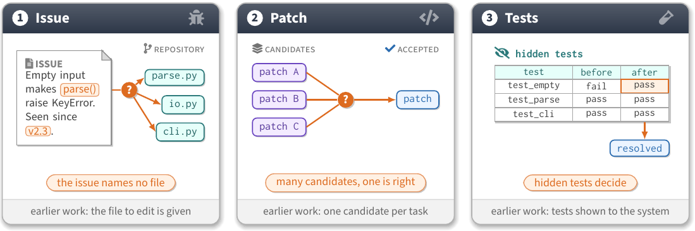

### 内容规划

写坐标之前先用几行字定下四件事，图的成败在这一步决定。

卡片数量与每张卡的唯一论点，标题是这个论点的一到三个词。卡片有两种编排：并列论点用编号徽标，与正文的列举一一对应，每张卡带一个橙色胶囊；流程阶段用普通标题，间隙里放阶段箭头，脚注带连起来读成一句话。

贯穿的例子取自论文里已有的清单、表格或示例，读者两次遇到同样的名字。例子要小，两张两三行的表，两三个类，一句话的文档。

橙色标注的对象是论文声称困难或新颖的那一处：输入没有声明的关联、没有字段承载的取值、某一步新增的元素、发生变化的单元格。其余元素保持蓝色、青紫或灰色。

脚注带写这张卡对照的是什么：早期工作的假设、输入、上一个阶段。一个短句，小写，无句点，6.3pt 下不超过 45 个字符。

### 几何预算

| 长度 | 默认 | 说明 |
|---|---|---|
| `\cardw` | 4.35cm | 阶段箭头需要更宽间隙时 3.95cm，两卡布局 4.8cm |
| `\cardh` | 4.45cm | 一张卡叠两张表时 4.8cm；按最高的那张卡设定一次 |
| `\cardgap` | 0.35cm | 带阶段箭头时 0.95cm |
| `\cardhh` | 0.6cm | 标题栏高度 |
| `\cardfh` | 0.5cm | 脚注带高度，`0pt` 去掉脚注带 |

5.5in 正文宽度下的横向预算是 `n*\cardw + (n-1)*\cardgap <= 13.8cm`，两种三卡配置都是 13.75cm。纵向可用区间从 `-\cardhh` 到 `-\cardh+\cardfh`；带胶囊时内容要止于 `-\cardh+\cardfh+0.55cm` 以上，不带胶囊时在脚注带上方留 0.25cm。

元素尺寸用来在写坐标之前先在纸上排一遍：

| 元素 | 尺寸 |
|---|---|
| 表格行 | 每行 0.28cm，表头计入 |
| 表格列 | 6.5pt 等宽字体每字符 0.105cm 再加 0.2cm，`New York City` 需要 1.55cm |
| 文档页 | 0.35cm 内边距 + 0.25cm 标签行 + 每行文字 0.28cm |
| 数据库圆柱 `\dbicon` | 缩放 1 时 0.3 x 0.45cm，缩放 0.72 时 0.22 x 0.32cm |
| 标签片、胶囊 | 高约 0.42cm；4.35cm 卡内胶囊约容 28 个字符 |
| 类框 | 表头 0.4cm + 每个属性行 0.26cm |
| 图例 | 7pt 每字符 0.11cm + 每个色块 0.46cm + `\legsep` 0.4cm |

决定布局的通常是最长的单元格取值和图例宽度。13 个字符的单元格放不进文档页旁边，四项图例放不到两张窄卡下面。

### 构件

```latex
\cardpanels{3}                         % P1 P2 P3，渐变标题栏、脚注带、边框
\cardheadn{P1}{1}{Issue}               % 编号徽标加标题
\cardhead{P2}{Entities}                % 无徽标的标题，用于流程阶段
\cardicon{P1}{bug}                     % 标题栏右端的淡白图标
\cardfoot{P1}{earlier work: the file to edit is given}
\cardpill{P1}{the issue names no file} % 橙色胶囊，各卡同一高度
\cardstage{P1}{P2}{extract}            % 跨间隙的阶段箭头，标签为小型大写
```

元素坐标一律相对自己所在的卡片书写，`($(P1.north west)+(0.3cm,-1.2cm)$)`。距卡片边缘留 0.25 到 0.3cm，有连接线沿左侧下行时左边留 0.9cm。

不要为了对齐把不同卡片里的元素强行放到同一坐标，那会在某张卡里留出大片空白。同类对齐更重要：胶囊等高（宏已保证），组标签在一张卡内成行，结果标签片与其来源的那一行齐平。

表格、标签片、问号徽标、文档页、代码框、类框各有对应的宏和 TikZ 样式。几条容易忽略的细节：

- 矩阵的每一列都要给 `text width`，否则不同内容的行高低不齐
- 单元格前加 `|[hi]|` 给它橙色边框和填充，用于故事所在的那个单元格
- 单元格名为 `<矩阵名>-<行>-<列>`，箭头连到 `aemp-1-3.east` 这样的锚点
- `drop shadow` 对矩阵和 `rectangle split` 节点无效，改用 `\boxshadow`
- 等宽字体里 `'` 渲染成右单引号，SQL 字符串要写 `\textquotesingle`
- `\\` 之后的前导空格会被丢弃，代码框内用 `~~` 缩进

流程图与输入输出对照的形态：

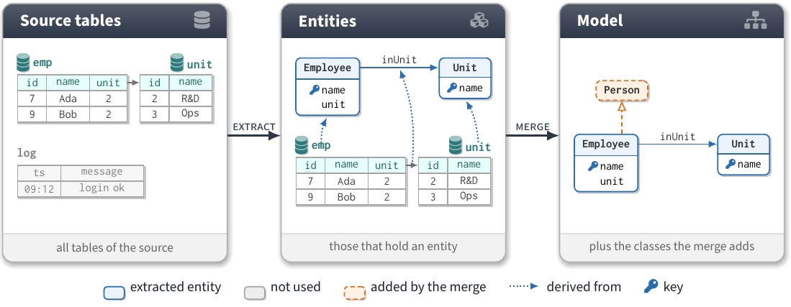

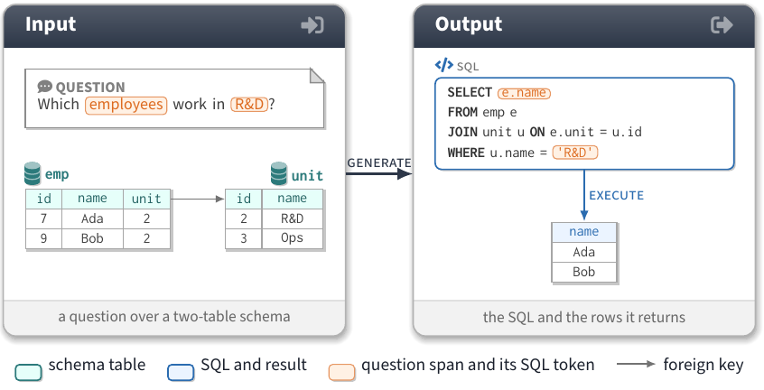

## 榜单条形图

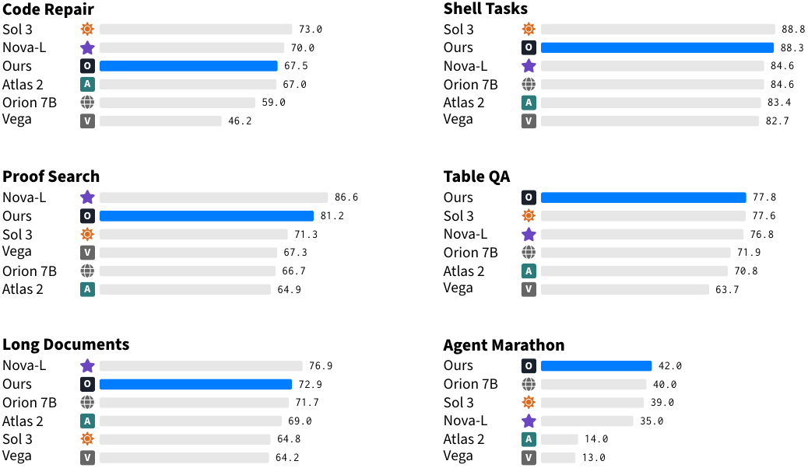

目标形态是 2 x 3 的面板网格，每格一个基准名加六行，每行是系统名、小图标、灰色条、末端的等宽分数。本方法的条为蓝色。整张图没有坐标轴、刻度和网格线，所有条共用一个刻度 `\barmax`（百分数用 100），所以某一格里的短条表示分数低，与坐标轴无关。

数字放进宽表 CSV，一行一个系统，一列一个基准，另有可选的 `icon` 列（`letter:K`、`fa:sun:addc`、`img:logos/x.pdf` 或原始 LaTeX）。数字从论文的结果表里取，图与表要精确到小数位一致。

```bash
python scripts/bars_from_csv.py results.csv --ours "Ours" --cols 2 --out figures/bars.tex
```

脚本把每格按分数降序排列（`--lower-better "Latency"` 用于越小越好的指标），把 `--ours` 指定的系统涂蓝，并从数据算出名字列宽、面板行距和 `\barmax`。面板按 CSV 的列顺序从左到右、再向下填充，调整列序即调整面板顺序。

### 面板参数

| 长度 | 默认 | 说明 |
|---|---|---|
| `\barpanelw` | 6.6cm | 三列时 4.2cm；最长的条的数值标签在这个宽度处结束 |
| `\barcolgap` | 0.6cm | 面板列间距 |
| `\barpanelpitch` | 2.75cm | 面板行距，等于 `\bartitlegap` + 行数 * `\barrowpitch` + 0.5cm |
| `\barnamew` | 1.6cm | 名字列，7pt 每字符 0.115cm 再加 0.15cm |
| `\bariconw` | 0.4cm | 图标列，无系统带图标时设 `0pt` |
| `\barvaluew` | 0.7cm | 满长条之后留给数值标签，四位数或带剑标用 0.85cm |
| `\barrowpitch` / `\barh` | 0.3cm / 0.17cm | 行距与条的厚度 |
| `\bartitlegap` | 0.45cm | 标题顶部到第一根条中心 |

手写面板用同一套宏：

```latex
\begin{barpanel}{0}{0}{Code Repair}                     % {列}{行} 从 0 开始，然后是标题
  \barrow{Sol 3}{\iconfa[addc]{sun}}{73.0}              % 行按分数降序
  \barrow[ours]{Ours}{\iconletter{O}}{67.5}             % 蓝色条
  \barrow[ours2]{Ours (no retrieval)}{}{61.0}           % 橙色条，无图标
  \barrow{Vega}{\iconletter[black!60]{V}}{46.2}[46.2$^\dagger$]
\end{barpanel}
\begin{barpanel}[10]{1}{0}{Latency (s)} ... \end{barpanel}  % 这一格在 10 处满格
```

`\barrow` 的数值参数必须是纯数字，剑标、百分号和 `--` 写进末尾的可选标签。某个系统缺这一项分数时省掉这一行，不要画零长的条。排序只按显示的数值。系统没有 logo 就把图标留空，不要编一个。

面板与卡片的差异：没有阴影，没有边框，文字为黑色，配色是上面那两个取样色。`ours2` 用橙色 `addc`，留给正文单独提到的第二个系统，例如某个消融配置。

## pgfplots 数据图

`plotfig.sty` 的 `paper` 坐标系样式把 PGF 手册和 Tufte 的建议固化下来：只画左侧和底部轴线，横向浅网格，刻度标签灰色，数字用正文字体，y 轴标签水平放在坐标系上方，序列名标在线的末端，一个系统在全篇用同一个颜色。

### 图表选型

| 段落要回答的问题 | 图表 |
|---|---|
| 若干系统的分数随数据量、算力或时间如何增长 | 折线加置信带，末端直接标名 |
| 少数系统在少数基准上的绝对数值对比 | 分组柱，每根柱上印数值 |
| 相对基线提升了多少，提升在哪里 | 哑铃图，成对圆点加提升量 |
| 哪些系统的开销与质量相称 | 开销对质量散点加 Pareto 前沿 |
| 任意方阵，例如每个源到每个目标的迁移 | 带数字的热力图 |
| 每个分组由什么构成，按占比 | 100% 堆叠横条 |
| 数据集的单维构成 | 环形图，总数放在中心 |
| 数据从哪流向哪，源如何分流 | 流向图，由 CSV 生成 |
| 多项能力上的整体形状对比 | 雷达图，仅在正文讨论形状时使用 |
| 本方法在众多基准上的排名 | 条形面板，见上一节 |

印了数值的柱状图不需要 y 轴。带末端标注的折线图不需要图例。热力图在读者要引用其中数字时才把数字印上去。雷达图是伪装的图例，系统不超过三个，轴不超过六条。

### 范例

顺序与上表一致。

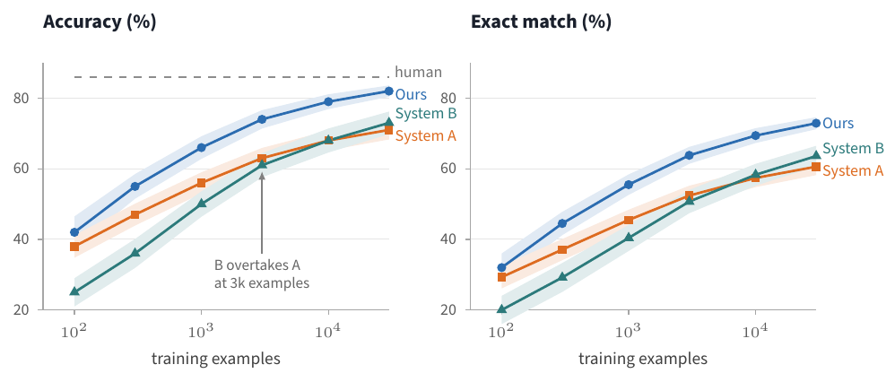

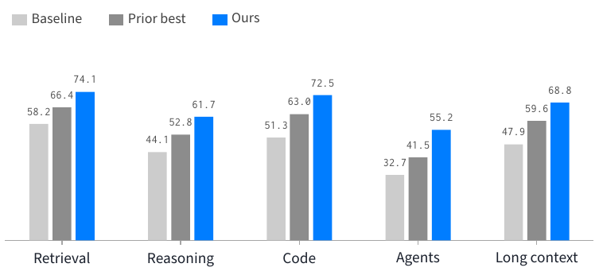

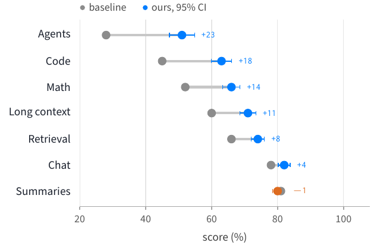

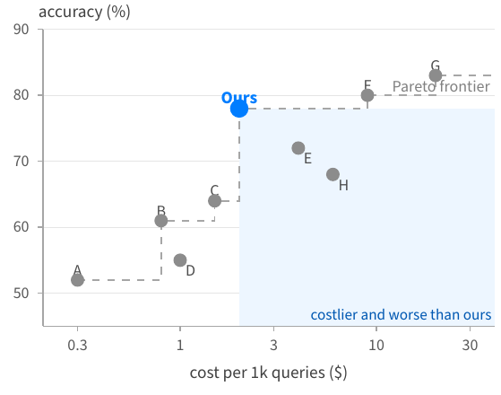

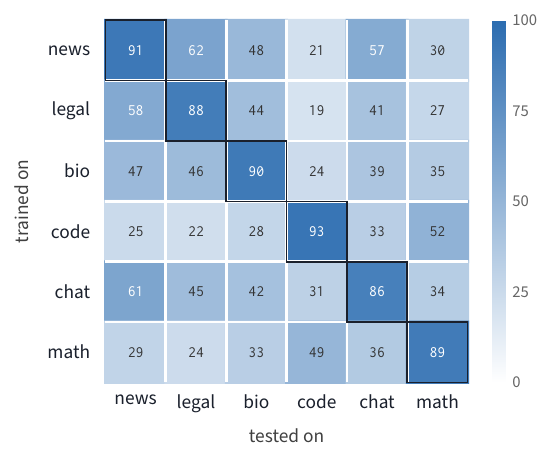

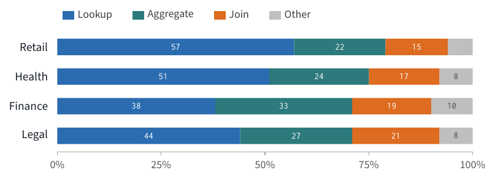

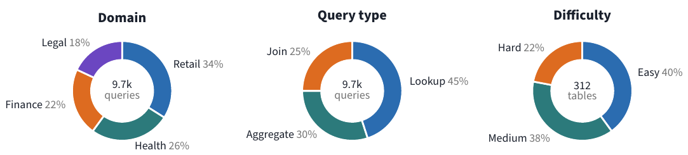

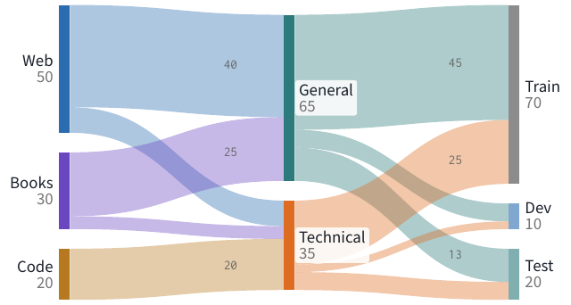

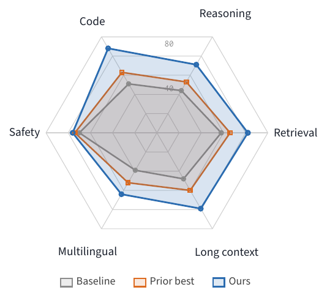

### 尺寸

| 用途 | 坐标系尺寸 |
|---|---|
| 双栏图中的单图 | 宽 6cm，高 4cm |
| 并排两格（`groupplots`） | 宽 4.9cm，高 3.5cm，`horizontal sep=1.15cm` |
| 通栏柱状图 | 宽 9.4cm，高 3.2cm，`bar width=0.3cm` |
| 热力图 | 6 x 6 时宽高各 4.6cm，色带另加 0.9cm |
| 堆叠横条 | 四行时宽 8.6cm，高 2.5cm |
| 雷达图 | 4.6cm，四周标签另占约 1cm |

`scale only axis` 使 `width` 和 `height` 指坐标系本身，标签和图例叠在其之上。尺寸在图文件里定，引入时用原尺寸。

### 配方

置信带是两条不可见路径加一次填充，画在折线之前，折线才会压在带子上面：

```latex
\addplot[name path=u, draw=none, forget plot] coordinates {...上界...};
\addplot[name path=l, draw=none, forget plot] coordinates {...下界...};
\addplot[kept!14, forget plot] fill between[of=u and l];
```

末端标注写成 `\addplot ... coordinates {...} node[dl, text=kept] {Ours};`，坐标系给 `enlarge x limits={upper=0.4}` 留出位置。两条线的末端相距 4pt 以内时，一个标签加 `yshift=3pt`，另一个加 `yshift=-3pt`。

参考线用于人类水平、随机水平或此前最好成绩：

```latex
\addplot[ref, forget plot] coordinates {(0,86) (100,86)} node[dl, text=black!55] {human};
```

热力图用 `matrix plot*` 加 `point meta=explicit` 和 `y dir=reverse`，单色 colormap 写成 `colormap={paperblues}{color(0cm)=(white); color(1cm)=(kept)}`，`point meta min/max` 固定，过半的单元格用白字，网格线为 1pt 白线。

柱上的数值由 `bars labelled` 加 `nodes near coords` 印出。要按表里的原文印（并且能用 `\ifnum` 判断），读法是 `visualization depends on={value \thisrow{v} \as \cellv}`。

注释每张图最多一处，用 `note` 加 `notearrow`，写正文正在讨论的那个发现。

## 构建与自检

```bash
python scripts/build_figure.py figures/name.tex --png-dir /tmp/cardfig
```

脚本在图所在目录调用 latexmk，清掉辅助文件，打印页面尺寸并给出宽度判定，再把第一页渲染成 PNG。编译出错时打印 `!` 开头的行和定位用的 `l.NN` 行。

每一轮都要打开 PNG 看一遍，日志不显示重叠、断词和错位。检查项：

- 没有元素接触或越过卡片边缘，脚注文字两侧留白
- 文档页和胶囊里没有断词
- 表格行高一致，高亮单元格的边框没被相邻单元格裁掉
- 箭头从正确的锚点出发和到达，中途不穿过标签或其他单元格
- 右侧和下方的阴影完整
- 宽度判定为 `ok`，5.5in 正文宽度下三张 4.35cm 卡片加 0.35cm 间隙是上限
- 图例没有超出卡片行的外缘，宽度判定看不出这一项
- 刻度标签和印出的数值不是 Computer Modern 字体
- 折线和柱压在置信带、网格与色块之上

两三轮迭代是正常的。改版时把新版写成 `name2.tex`，旧文件保留，再生成一张上下对照图交给读者比较：

```bash
python scripts/compare_sheet.py --out /tmp/before-after.png "before=figures/name.pdf" "after=figures/name2.pdf"
```

引入论文时不带 `width` 选项，主文件里写 `\graphicspath{{figures/}}`。图注给出读图钥匙（颜色的含义、脚注带是什么）以及图本身推不出的结论，不复述胶囊和标题。重新编译论文后查 `grep -c Overfull main.log`，超宽 0.5pt 只在这里显形。源文件与产出的 PDF 一起提交。

## 常见错误

| 现象 | 原因与处理 |
|---|---|
| 用 `\tikzmarknode` 定位的节点每次编译都在动 | 标记坐标来自上一遍的 `.aux`。凡从标记定位的节点和路径都要加 `overlay`，图片加 `remember picture` |
| calc 表达式内部用标记坐标做垂直对齐，位置错误且不报错 | 先 `\coordinate (bx) at (...)` 取出偏移点，再对 `bx` 做对齐 |
| 图只超宽 0.5pt，只有论文的 log 报 Overfull | pdftex 看到的宽度比 `pdfinfo` 报的约大 1.5pt。三张 4.35cm 卡片时 standalone 的 `border` 左右合计最多 4pt |
| 阴影在右侧或下方被切掉 | 阴影不计入 bounding box，这是 3pt 右边距和 3.5pt 下边距的用途，不要调小 |
| 文档页里的单词断行 | `doc` 样式已关掉断词。仍然溢出就缩短句子或加宽 `text width`，不要重新打开断词 |
| `\end{axis}` 处报 `Illegal parameter number in definition of \tikz@scan@point@coordinate` | 坐标系内的路径到 `\end{axis}` 才执行，`\foreach` 的变量已失效。改用 `\pgfplotsinvokeforeach` |
| 印出的数值成了 `91.000000000` | 写 `visualization depends on={value \thisrow{v} \as \cellv}`，`value` 保持单元格原文 |
| 刻度数字是 Computer Modern 而标签是无衬线 | pgfplots 默认刻度模板带 `$...$`。`paper` 样式已替换，色带是独立坐标系，要在 `colorbar style` 里再设一次 |
| 图例显示成默认的柱状图标 | `ybar` 和 `xbar stacked` 会设置自己的 `legend image code`，`legend top` 要写在它们之后 |
| 隐藏 y 轴之后行名消失 | `axis y line=none` 连刻度标签一起去掉了，改用 `y axis hidden` |
| 内联表格报 `File ended while scanning use of \pgfplotstableread@loop@next` | 表头要另起一行写在 `{` 之后，结尾的 `};` 单独占一行 |
| `Undefined control sequence \faFileAlt` | 部分 fontawesome5 图标没有宏名，统一写 `\faIcon{file-alt}` |
| `shadow opacity=0.45` 之后模糊阴影不见了 | `shadows.blur` 里 `shadow opacity` 取百分数（45），`drop shadow` 里 `opacity` 取小数（0.22） |
| Windows 下用 Bash heredoc 写 `.tex` 文件 | `\\` 会被折叠，`\f` 变成换页符。用文件工具写和改 `.tex`，不要用 `cat <<EOF` 或 `sed` |
| 论文编译通过但显示的是旧图 | 查论文 log 里那张图报告的尺寸（`<figures/name.pdf, id=..., 397pt x ...>`），确认图的 PDF 已重新编译并已推送到 Overleaf |
